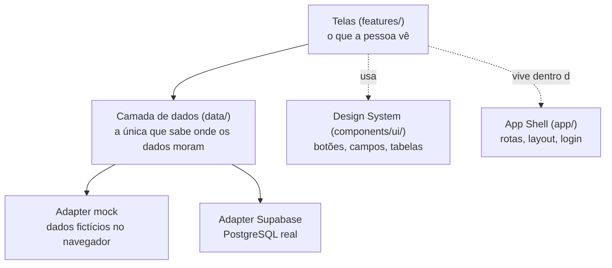
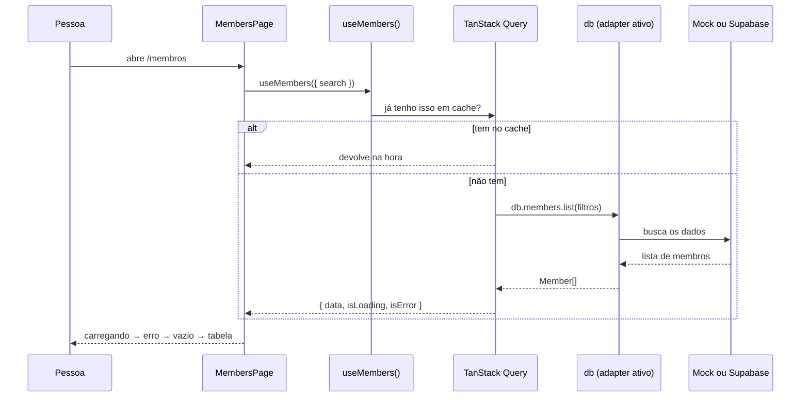
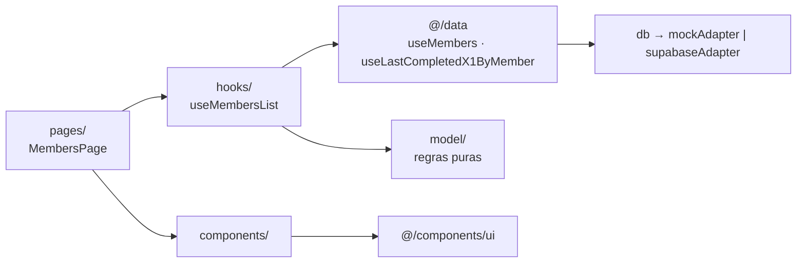

# ARCHITECTURE — como o código está organizado e por quê

Escrito para ser entendido por quem está começando. Se algo aqui não fizer
sentido, é falha do documento — avise o Cauan.

---

## 1. A ideia central

Três camadas, com uma regra simples entre elas:



**A regra:** uma tela **nunca** fala com banco de dados, `fetch` ou
`localStorage`. Ela chama a camada de dados. Sempre.

Isso é o que permite trocar o banco sem reescrever a interface — e é o que faz
o projeto rodar sem nenhuma configuração para quem só quer construir telas.

---

## 2. Por que existem dois adapters

Este é o ponto mais importante da arquitetura.

O time tem cinco pessoas trabalhando em paralelo, e várias delas não deveriam
precisar de banco de dados, conta na nuvem ou variável de ambiente para
começar a trabalhar.

Então a camada de dados tem **duas implementações do mesmo contrato**:

| Modo | O que é | Quando usar |
| --- | --- | --- |
| `mock` (padrão) | Dados fictícios guardados no navegador | Desenvolver telas. Não precisa de nada. |
| `supabase` | PostgreSQL real com autenticação | Integração e produção. |

A escolha é uma linha no `.env`:

```bash
VITE_DATA_SOURCE=mock
```

Quem escreve uma tela chama `useMembers()` e recebe membros. **Não sabe e não
precisa saber** qual dos dois está ativo. O que funciona em um funciona no outro.

Consequência prática: Gabi, Bia e Clara clonam o repositório, rodam
`npm install && npm run dev` e já têm uma aplicação funcionando com dados —
enquanto a Sofia monta o banco real em paralelo, sem bloquear ninguém.

---

## 3. Fluxo de uma tela, do clique ao dado

Exemplo: a pessoa abre a lista de membros.



Na prática, na sua tela isso é:

```tsx
const { data: members, isLoading, isError, refetch } = useMembers({ search });

if (isLoading) return <LoadingState />;
if (isError) return <ErrorState onRetry={refetch} />;
if (!members?.length) return <EmptyState title="Nenhum membro encontrado" />;

return <>{/* a tabela */}</>;
```

**Esses quatro estados são obrigatórios.** Uma tela que só trata o caso feliz
não está pronta.

---

## 4. Estrutura de pastas

```
src/
├── app/                    ← SHELL — dono: Cauan
│   ├── router.tsx            todas as rotas (já registradas)
│   ├── routes.ts             constantes de caminho
│   ├── navigation.ts         itens da barra lateral
│   ├── providers.tsx         contextos globais
│   ├── layouts/              AppLayout (interno) e PublicLayout
│   ├── components/           Sidebar, ErrorBoundary, FeatureStub
│   └── pages/                NotFoundPage
│
├── components/ui/          ← DESIGN SYSTEM — dono: Cauan/Gabi
│   ├── button.tsx  form.tsx  surface.tsx  overlay.tsx
│   ├── display.tsx states.tsx table.tsx   tabs.tsx
│   └── index.ts              importe sempre daqui
│
├── data/                   ← CAMADA DE DADOS — dona: Sofia
│   ├── types.ts              modelo de domínio (fonte de verdade)
│   ├── adapter.ts            contrato que os dois adapters cumprem
│   ├── db.ts                 escolhe o adapter ativo
│   ├── queryKeys.ts          chaves de cache centralizadas
│   ├── members.ts x1.ts feedbacks.ts anonymousFeedback.ts settings.ts
│   │                         funções + hooks de cada domínio
│   ├── mock/                 fixtures, store local, mockAdapter
│   ├── supabase/             client, mappers, supabaseAdapter
│   └── import/               leitura e validação da base CITi Pessoas
│
├── features/               ← UMA PASTA POR FEATURE
│   ├── auth/                 Cauan
│   ├── members/              Gabi (Membros e Perfil)
│   ├── x1/                   Bia
│   ├── feedbacks/            Clara
│   ├── anonymous-feedback/   Clara
│   ├── admin/                Bia / Cauan
│   ├── import/               Sofia
│   └── design-system/        catálogo visual (só em dev)
│
├── lib/                    cn, format, env
└── styles/                 tokens da identidade visual do CITi
```

---

## 4.1. Como uma feature se organiza por dentro — Membros + X1 é a referência

Membros, Perfil e X1 são a **primeira implementação completa** da Fase 1, e
foram escritos para servir de modelo. Feedbacks, Moderação e Administração
devem seguir a mesma divisão em vez de inventar outra.

```
src/features/<feature>/
├── pages/          A tela. Compõe, decide o que mostrar. Não calcula regra.
├── components/     Pedaços da tela. Só componentes de @/components/ui dentro.
├── hooks/          Composição: junta hooks de @/data e entrega dados prontos.
├── model/          Regras PURAS: sem React, sem fetch. É o que tem teste.
└── schemas/        Validação com zod + conversão formulário → modelo.
```

A ordem em que as coisas se chamam:



**A regra que faz isso valer a pena:** `model/` não importa React nem `@/data/db`.
É por isso que `membersList.test.ts` e `x1Schema.test.ts` rodam em milissegundos
e testam regra de produto de verdade, sem montar tela nenhuma.

### Onde cada tipo de lógica mora

| Tipo | Onde | Exemplo |
| --- | --- | --- |
| Regra de domínio compartilhada | `src/data/x1.ts` | `getMemberX1Status`, `nextRecommendedX1Date` |
| Regra só de uma tela | `features/<f>/model/` | `summarizeMembers`, `applyDerivedFilters` |
| Composição de consultas | `features/<f>/hooks/` | `useMembersList`, `useMemberX1` |
| Validação de formulário | `features/<f>/schemas/` | `memberFormSchema`, `x1FormSchema` |
| Como aparece na tela | `features/<f>/components/` | `MemberCard`, `X1HistoryItem` |

### Nada derivado é gravado

O ponto mais importante da feature de X1: **situação, último X1, próximo
recomendado e contagem de conversas são todos calculados a partir do histórico**,
sempre. Não existe `member.lastX1Date` nem `member.x1Status` no modelo.

Consequência prática: registrar um X1 atualiza o histórico, a timeline, o
resumo, a listagem e a situação de uma vez só — porque as cinco coisas leem a
mesma fonte. Se alguém adicionar um campo derivado ao banco "para ficar mais
rápido", esta garantia acaba e as telas passam a discordar entre si.

### Dois filtros, dois lugares — e por quê

Na listagem de membros:

| Filtro | Resolvido em | Motivo |
| --- | --- | --- |
| busca · subárea · situação no CITi · GG responsável | camada de dados (`MemberFilters`) | um banco filtra isso melhor do que o navegador |
| cargo · situação de X1 | camada derivada (`applyDerivedFilters`) | situação de X1 **não existe no banco** — é calculada. Cargo ainda não está em `MemberFilters` |

A tela não sabe dessa divisão: ela entrega um objeto de filtros para
`useMembersList` e recebe a lista. Se um dia cargo virar coluna filtrável,
some uma linha de `applyDerivedFilters` e **nenhum componente muda**.

---

## 4.2. Quando o backend real chegar

A troca de mock por API acontece **dentro de `src/data/`**, e só ali.

### Hoje

```text
Página (features/)  →  hooks da feature  →  hooks de @/data  →  db  →  mockAdapter
                                                                       ↓
                                                          mock/store.ts (localStorage)
```

### Depois

```text
Página (features/)  →  hooks da feature  →  hooks de @/data  →  db  →  apiAdapter
                                                                       ↓
                                                              backend → banco
```

**O que NÃO muda** — nenhuma linha:

- `src/features/**` inteiro: páginas, componentes, hooks de composição, model, schemas
- `src/components/ui/**`
- `src/data/types.ts`, `adapter.ts`, `queryKeys.ts`, `errors.ts`
- os hooks de domínio (`useMembers`, `useX1sByMember`, `useCreateX1`, …)
- as regras puras (`getMemberX1Status`, `nextRecommendedX1Date`, `applyDerivedFilters`)
- os testes de regra

**O que muda:**

| Arquivo | O que acontece |
| --- | --- |
| `src/data/supabase/supabaseAdapter.ts` | já é a implementação real; ou nasce um `api/apiAdapter.ts` irmão |
| `src/data/db.ts` | uma linha: qual adapter `VITE_DATA_SOURCE` escolhe |
| `src/data/mock/**` | continua existindo, para desenvolver tela sem banco |

**O que some:** nada. O modo mock é a forma de trabalhar sem depender de
infraestrutura, não um andaime a ser jogado fora.

**Por que a conta fecha:** as telas nunca importaram `mockAdapter`, `fixtures`
nem `localStorage`. Elas importam de `@/data`. Confira com
`grep -r "mock/" src/features/` — o resultado tem que continuar vazio.

---

## 5. Fronteiras — quem mexe em quê

Esta tabela existe para evitar que cinco branches briguem pelo mesmo arquivo.

| Área | Dono | Outras pessoas podem… |
| --- | --- | --- |
| `src/app/**` | Cauan | ler, não alterar |
| `src/components/ui/**` | Cauan / Gabi | usar; alterar só combinando antes |
| `src/data/**` | Sofia | usar os hooks; não alterar o contrato |
| `src/styles/**` | Cauan | usar os tokens; não alterar valores |
| `src/features/members/**` | Gabi | livre |
| `src/features/x1/**` | Bia | livre |
| `src/features/feedbacks/**` | Clara | livre |
| `src/features/anonymous-feedback/**` | Clara | livre |
| `src/features/admin/**` | Bia | livre |
| `src/features/import/**` | Sofia | livre |
| `supabase/migrations/**` | Sofia | não alterar |

**Dentro da sua pasta de feature você tem liberdade total.** Crie
subcomponentes, arquivos auxiliares, o que precisar.

### Por que quase ninguém precisa tocar em arquivo compartilhado

Três decisões deliberadas:

1. **Todas as rotas da Fase 1 já estão registradas** em `router.tsx`. Sua página
   já existe e já está ligada — você só troca o conteúdo dela.
2. **Todos os itens de navegação já existem** em `navigation.ts`.
3. **Todos os hooks de dados já existem.** Você não precisa criar acesso a dados
   para implementar sua feature.

---

## 6. Tecnologias e o motivo de cada uma

| Escolha | Por quê |
| --- | --- |
| **React + TypeScript** | O protótipo já era React; o TypeScript avisa o erro no editor, antes de virar bug. Especialmente útil quando o código é escrito com IA. |
| **Vite** | Rápido, configuração mínima, um comando para rodar. |
| **Tailwind v4** | Já usado no protótipo. Estilo junto do componente, sem inventar nome de classe. Os tokens da marca ficam em um arquivo só. |
| **React Router** | URL de verdade: `/membros/123` pode ser compartilhada, o botão voltar funciona, e cada feature tem sua rota — o que reduz conflito. |
| **TanStack Query** | Resolve cache, loading, erro e recarga depois de salvar. Sem ele, cada pessoa inventaria um jeito diferente de tratar loading. |
| **Supabase** | PostgreSQL + autenticação + regras de acesso sem manter servidor. O time não tem quem cuide de infraestrutura. |
| **react-hook-form + zod** | Validação declarada uma vez, mensagem de erro em português, tipos derivados automaticamente. |
| **Vitest + Testing Library** | Mesma configuração do Vite, sem setup extra. |

Registro completo das decisões, com alternativas consideradas:
[DECISIONS.md](DECISIONS.md).

---

## 7. Autenticação

```mermaid
flowchart LR
    A[Pessoa acessa /membros] --> B{Tem sessão?}
    B -- não --> C[/login]
    C --> D[signIn]
    D --> E{Credenciais válidas?}
    E -- não --> F[Mensagem de erro]
    E -- sim --> G{Tem perfil autorizado?}
    G -- não --> H[Acesso negado<br/>fale com a GG]
    G -- sim --> I[Volta para a página pedida]
    B -- sim --> I
```

Pontos importantes:

- **Não existe autorregistro público.** Não há tela de cadastro, e não deve haver.
- No Supabase, ter conta no Auth **não basta**: é preciso existir uma linha em
  `profiles`. É assim que a GG controla quem entra.
- GG e Diretoria de GG têm o **mesmo acesso funcional**. O papel existe para
  exibição e evolução futura, não para esconder funcionalidade.
- A única rota pública além do login é o formulário de feedback anônimo.

---

## 8. Segurança dos dados

- As chaves ficam em `.env`, que está no `.gitignore`.
- No Supabase, quem protege os dados é o **Row Level Security**: mesmo com a
  chave pública, ninguém lê a tabela de membros sem perfil autorizado.
- A tabela `anonymous_feedbacks` aceita **inserção pública** (o formulário
  externo) mas **leitura só para GG** — e não possui coluna de autor, e-mail ou
  IP. O anonimato é estrutural.
- `.csv` e `.xlsx` estão bloqueados no `.gitignore` para que planilha com dado
  real nunca entre por acidente.

---

## 9. Quando você PRECISA mexer em algo compartilhado

Acontece. O procedimento é:

1. Pare antes de editar.
2. Avise o Cauan (ou a Sofia, se for `src/data/`).
3. Faça a alteração em um commit separado, pequeno e isolado.
4. Descreva no PR o que mudou e por quê.

O que **nunca** deve ser feito sem combinar: adicionar dependência ao
`package.json`, mudar token de cor, mudar o contrato da camada de dados, alterar
migration já aplicada.
