# BACKLOG — Fase 1

Versão legível por humanos. A versão estruturada, para ferramentas e para o
Artifact "CITi Pessoas — Central de Desenvolvimento", está em
[`backlog.json`](backlog.json). **Mantenha os dois em sincronia.**

**Legenda de status:** `Done` · `Ready` (pode começar) · `Blocked` (depende de
outra) · `In Progress`

**Dificuldade** (escala do time, Plano de Execução §44):
🟢 **guiada** — dá para seguir o passo a passo · 🟡 **assistida** — precisa de apoio pontual · 🔴 **técnica** — exige Cauan ou Sofia

**Revisão.** Todo PR tem *reviewer técnico* (matriz do Plano §36: Gabi→Cauan, Bia e Clara→Cauan/Sofia, Cauan↔Sofia) e, nas features, um *reviewer funcional* — quem é dono do domínio testa como GG.

**Labels do GitHub:** `area:` · `difficulty:` · `priority:`. **Colunas do Project:** Backlog → Ready → In Progress → Review → Testing → Done.

---

## EPIC 0 — Fundação · Cauan e Sofia

| ID | Item | Responsável | Status |
| --- | --- | --- | --- |
| BASE-001 | Auditar stack e arquitetura | Cauan | ✅ Done |
| BASE-002 | Preparar estrutura do projeto | Cauan | ✅ Done |
| BASE-003 | App Shell | Cauan | ✅ Done |
| BASE-004 | Design System inicial | Cauan | ✅ Done |
| BASE-005 | Autenticação | Cauan | ✅ Done |
| DATA-001 | Modelo Membro | Sofia | ✅ Done |
| DATA-002 | Modelo X1 | Sofia | ✅ Done |
| DATA-003 | Modelo Feedback | Sofia | ✅ Done |
| DATA-004 | Modelo Feedback Anônimo | Sofia | ✅ Done |
| DATA-005 | Dados de desenvolvimento | Sofia | ✅ Done |
| DATA-006 | Fundação da importação | Sofia | ✅ Done |

Pendência do EPIC 0: aplicar a migration em um projeto Supabase real e convidar
as contas da GG — **BASE-006**, responsável Sofia/Cauan.

---

## Onboarding — antes de qualquer feature

Plano de Execução §18–19: cada pessoa passa pelo fluxo completo uma vez, com uma
alteração mínima, **antes** de precisar entender a lógica de uma feature.

| ID | Pessoa | Reviewer | Branch |
| --- | --- | --- | --- |
| ONB-001 | Gabi | Cauan | `docs/onboarding-gabi` |
| ONB-002 | Bia | Cauan/Sofia | `docs/onboarding-bia` |
| ONB-003 | Clara | Cauan/Sofia | `docs/onboarding-clara` |

**Objetivo.** Clonar → rodar → alterar um texto → branch → commit → push → PR →
review → merge. 🟢 guiada.

**Critérios de aceite**

- [ ] Projeto rodando com `npm run dev`
- [ ] Login feito com as credenciais de desenvolvimento
- [ ] Uma alteração pequena de texto visível no navegador
- [ ] Branch, commit, push e PR
- [ ] PR revisado e mergeado

---

## EPIC 1 — Membros · Feature Owner: Gabi

### MEM-001 — Listagem de membros

- **Épico:** Membros · **Responsável:** Gabi · **Reviewer:** Cauan
- **Dificuldade:** 🟢 guiada · **Prioridade:** Alta · **Status:** ✅ Done
- **Dependências:** nenhuma
- **Branch:** `feat/members-list`

**Objetivo.** A pessoa da GG abre `/membros` e vê todas as pessoas do CITi em
uma tabela, com o essencial para decidir quem precisa de atenção.

**Critérios de aceite**

- [x] A tabela mostra nome (com avatar), cargo, subárea e situação de X1.
- [x] Os dados vêm de `useMembers()`.
- [x] A situação de X1 usa `getMemberX1Status()` — quem nunca teve X1 aparece
      como "Primeiro X1 pendente", **não** como atrasado.
- [x] Funciona no celular sem a página rolar para o lado.
- [x] Usa apenas componentes de `@/components/ui`.

---

### MEM-002 — Busca

- **Responsável:** Gabi · **Reviewer:** Cauan · 🟢 guiada · Alta · ✅ Done
- **Dependências:** MEM-001 · **Branch:** `feat/members-search`

**Objetivo.** Encontrar uma pessoa digitando parte do nome ou do e-mail.

**Critérios de aceite**

- [x] `<SearchInput>` acima da tabela.
- [x] Busca ignora acento e maiúsculas ("iris" encontra "Íris").
- [x] O termo fica na URL (`?busca=`), para o link poder ser compartilhado.
- [x] Sem resultado → `EmptyState` citando o termo buscado.

---

### MEM-003 — Filtros

- **Responsável:** Gabi · **Reviewer:** Cauan · 🟡 assistida · Média · ✅ Done
- **Dependências:** MEM-001 · **Branch:** `feat/members-filters`

**Objetivo.** Filtrar por subárea e por situação, combinando com a busca.

**Critérios de aceite**

- [x] Filtro por subárea usando a constante `AREAS`.
- [x] Filtro por status (ativo / desligado / arquivado); o padrão mostra ativos.
- [x] Filtros combinam com a busca.
- [x] Dá para limpar todos de uma vez.

---

### MEM-004 — Acesso ao Perfil

- **Responsável:** Gabi · **Reviewer:** Cauan · 🟢 guiada · Alta · ✅ Done
- **Dependências:** MEM-001, PERFIL-001 · **Branch:** `feat/member-profile-link`

**Critérios de aceite**

- [x] Clicar na linha abre `/membros/:id`.
- [x] Usa `ROUTES.memberProfile(id)`, nunca string escrita à mão.
- [x] Funciona com Enter pelo teclado.

---

### MEM-005 — Loading, vazio e erro

- **Responsável:** Gabi · **Reviewer:** Cauan · 🟢 guiada · Alta · ✅ Done
- **Dependências:** MEM-001 · **Branch:** `feat/members-states`

**Critérios de aceite**

- [x] `LoadingState` enquanto carrega.
- [x] `ErrorState` com "Tentar novamente" em caso de falha.
- [x] `EmptyState` explicando o porquê quando não há resultado.

> Pode ser feito junto com MEM-001. Está separado porque é o item mais esquecido.

---

## EPIC 2 — Perfil do Membro · Feature Owner: Gabi

### PERFIL-001 — Estrutura do Perfil

- **Responsável:** Gabi · **Reviewer:** Cauan · 🟡 assistida · Alta · ✅ Done
- **Dependências:** nenhuma · **Branch:** `feat/member-profile`

**Objetivo.** A página do membro, com cabeçalho de identificação e a estrutura
onde as demais seções vão encaixar.

**Critérios de aceite**

- [x] Carrega com `useMember(memberId)`.
- [x] Cabeçalho: avatar, nome, cargo, subárea, squad, situação de X1.
- [x] Membro inexistente → mensagem clara, não tela quebrada.
- [x] Link de voltar para `/membros`.
- [x] Quatro estados tratados.

---

### PERFIL-002 — Dados cadastrais

- **Responsável:** Gabi · **Reviewer:** Sofia · 🟢 guiada · Alta · ✅ Done
- **Dependências:** PERFIL-001 · **Branch:** `feat/member-profile-data`

**Critérios de aceite**

- [x] Mostra e-mails, telefone, curso, período, universidade, data de entrada,
      tempo de casa, gerente e responsável de GG.
- [x] Campo vazio aparece como "—", nunca como `null` ou espaço em branco.
- [x] Datas formatadas com `formatDate()`.

---

### PERFIL-003 — Tabs/seções

- **Responsável:** Gabi · **Reviewer:** Cauan · 🟡 assistida · Alta · ✅ Done
- **Dependências:** PERFIL-001 · **Branch:** `feat/member-profile-tabs`

**Objetivo.** Abas: Visão geral · X1 · Feedbacks · Timeline.

**Critérios de aceite**

- [x] Usa `<Tabs>` do design system.
- [x] A aba ativa fica na URL (`?aba=x1`), para poder ser compartilhada.
- [x] Abas de X1 e Feedbacks ficam com um aviso de "em construção" — Bia e Clara
      preenchem em X1-008 e FB-007.

> ⚠️ Desbloqueia X1-008 e FB-007. **Priorize.**

---

### PERFIL-004 — Timeline inicial

- **Responsável:** Gabi · **Reviewer:** Sofia · 🟡 assistida · Média · ✅ Done
- **Dependências:** PERFIL-003 · **Branch:** `feat/member-timeline`

**Critérios de aceite**

- [x] Usa `useMemberEvents(memberId)`, do mais recente para o mais antigo.
- [x] Cada evento mostra data, título e descrição, com ícone por tipo.
- [x] Estado vazio quando não há eventos.

---

### PERFIL-005 — Integração de X1 e Feedback

- **Responsável:** Gabi · **Reviewer:** Cauan · 🟡 assistida · Média · **Parcial**
- **Dependências:** ~~X1-008~~, FB-007 · **Branch:** `feat/member-profile-integration`

A aba de X1 já está integrada ao Perfil. Falta a seção de Feedbacks (FB-007),
que hoje mostra um estado "preparado" explicando o que vai aparecer ali.

---

## EPIC 3 — X1 · Feature Owner: Bia

> **Regras de produto:** o X1 não é avaliação de desempenho. O histórico é
> preservado. Quem entrou agora é "primeiro X1 pendente", não atrasado.

### X1-001 — Novo X1

- **Responsável:** Bia · **Reviewer:** Cauan · 🟡 assistida · Alta · ✅ Done
- **Dependências:** nenhuma · **Branch:** `feat/x1-form`

**Objetivo.** Registrar um X1 que aconteceu: membro, data, resumo, principais
pontos e encaminhamentos.

**Critérios de aceite**

- [x] Formulário em `<Modal>`, com `react-hook-form` + `zod`.
- [x] Campos: membro, data, quem conduziu, link do Google Docs, resumo,
      encaminhamentos.
- [x] **Hard skills**, **soft skills** e **habilidades que a pessoa quer
      desenvolver** (alimentam o futuro PDI).
- [x] **Avaliação dos quatro valores do CITi** (`CITI_VALUES`), opcional.
- [x] Campo de comentários relevantes.
- [x] Erros de validação em português.
- [x] **Nenhum campo de nota de desempenho.** A avaliação de valores é percepção
      humana registrada, não score.
- [x] Botão mostra `loading` ao salvar.
- [x] Carimba `gestaoId` com `useCurrentGestao()`.

---

### X1-002 — Persistir X1

- **Responsável:** Bia · **Reviewer:** Sofia · 🟢 guiada · Alta · ✅ Done
- **Dependências:** X1-001 · **Branch:** `feat/x1-persist`

**Critérios de aceite**

- [x] Salva com `useCreateX1()`.
- [x] A lista atualiza sozinha depois de salvar.
- [x] Erro ao salvar aparece na tela, sem fechar o formulário nem perder o texto.

---

### X1-003 — Histórico de X1

- **Responsável:** Bia · **Reviewer:** Cauan · 🟢 guiada · Alta · ✅ Done
- **Dependências:** X1-002 · **Branch:** `feat/x1-history`

**Critérios de aceite**

- [x] `useX1sByMember()`, do mais recente para o mais antigo.
- [x] Cada item mostra data, quem conduziu, status e início do resumo.
- [x] Quatro estados tratados.

---

### X1-004 — Visualizar X1

- **Responsável:** Bia · **Reviewer:** Cauan · 🟢 guiada · Média · ✅ Done
- **Dependências:** X1-003 · **Branch:** `feat/x1-detail`

**Critérios de aceite**

- [x] Detalhe completo em `<Drawer>` ou `<Modal>`.
- [x] Link do documento externo abre em nova aba, quando existir.

---

### X1-005 — Editar X1

- **Responsável:** Bia · **Reviewer:** Cauan · 🟡 assistida · Média · Ready
- **Dependências:** X1-004 · **Branch:** `feat/x1-edit`

**Critérios de aceite**

- [ ] Reaproveita o formulário de X1-001.
- [ ] Salva com `useUpdateX1()`.
- [ ] Deixa claro na interface que editar corrige **aquele** registro — não
      substitui o histórico.

---

### X1-006 — Status do X1

- **Responsável:** Bia · **Reviewer:** Cauan · 🟡 assistida · Alta · ✅ Done
- **Dependências:** X1-003 · **Branch:** `feat/x1-status`

**Critérios de aceite**

- [x] Registro: agendado / realizado / cancelado, com `Badge` no tom certo.
- [x] Situação do membro vem de `getMemberX1Status()`.
- [x] **Nunca grava "atrasado" no banco.**
- [x] Membro recém-chegado aparece como "Primeiro X1 pendente".

---

### X1-007 — Periodicidade

- **Responsável:** Bia · **Reviewer:** Sofia · 🟡 assistida · Média · **Parcial**
- **Dependências:** ADM-001 · **Branch:** `feat/x1-periodicity`

> A periodicidade já é respeitada (`x1PeriodicityFor`) e exibida no resumo de X1
> do Perfil, com aviso quando o membro tem exceção. Falta só a tela da
> Administração para editá-la (ADM-001).

**Critérios de aceite**

- [ ] Usa `x1PeriodicityFor()` — respeita a exceção do membro.
- [ ] O Perfil mostra qual periodicidade vale para aquele membro.

---

### X1-008 — Integração com Perfil

- **Responsável:** Bia · **Reviewer:** Gabi · 🟡 assistida · Alta · **Blocked**
- **Dependências:** PERFIL-003, X1-003 · **Branch:** `feat/x1-in-profile`

A aba de X1 dentro do Perfil. **Combine com a Gabi antes de começar.**

---

## EPIC 4 — Feedbacks · Feature Owner: Clara

> **Regras de produto:** registros independentes e ilimitados. Tipos: Informal,
> Formal, Carta de Ajuste. Sem campos rígidos FI1/FI2.

### FB-001 — Registrar Feedback

- **Responsável:** Clara · **Reviewer:** Cauan · 🟡 assistida · Alta · Ready
- **Dependências:** nenhuma · **Branch:** `feat/feedback-form`

**Critérios de aceite**

- [ ] Formulário em `<Modal>` com membro, tipo, conteúdo e data.
- [ ] Os três tipos disponíveis, usando `FEEDBACK_TYPE_LABEL`.
- [ ] **Sem limite de quantidade e sem campos numerados.**
- [ ] Validação com mensagens em português.

---

### FB-002 — Persistir Feedback

- **Responsável:** Clara · **Reviewer:** Sofia · 🟢 guiada · Alta · Ready
- **Dependências:** FB-001 · **Branch:** `feat/feedback-persist`

**Critérios de aceite**

- [ ] Salva com `useCreateFeedback()`; a lista atualiza sozinha.
- [ ] Erro tratado sem perder o que foi digitado.

---

### FB-003 — Histórico

- **Responsável:** Clara · **Reviewer:** Cauan · 🟢 guiada · Alta · Ready
- **Dependências:** FB-002 · **Branch:** `feat/feedback-history`

**Critérios de aceite**

- [ ] `useFeedbacksByMember()`, mais recente primeiro.
- [ ] Tipo visível com `Badge`.
- [ ] Quatro estados tratados.

---

### FB-004 — Visualização

- **Responsável:** Clara · **Reviewer:** Cauan · 🟢 guiada · Média · Ready
- **Dependências:** FB-003 · **Branch:** `feat/feedback-detail`

Detalhe completo, com quem registrou e quando.

---

### FB-005 — Edição quando apropriado

- **Responsável:** Clara · **Reviewer:** Cauan · 🟡 assistida · Baixa · Ready
- **Dependências:** FB-004 · **Branch:** `feat/feedback-edit`

**Critérios de aceite**

- [ ] Salva com `useUpdateFeedback()`.
- [ ] Editar corrige o registro; **não apaga histórico**.

---

### FB-006 — Quadro consolidado

- **Responsável:** Clara · **Reviewer:** Cauan · 🟡 assistida · Alta · Ready
- **Dependências:** FB-003 · **Branch:** `feat/feedback-board`

**Objetivo.** Em `/feedbacks`, todos os feedbacks de todos os membros.

**Critérios de aceite**

- [ ] `useAllFeedbacks()`.
- [ ] Quadro com **uma linha por membro e contagem por tipo**:

      | Membro | Informais | Formais | Cartas de Ajuste |

- [ ] Clicar em uma contagem ou no membro abre os registros correspondentes.
- [ ] Filtro por tipo e busca por membro.
- [ ] Quatro estados tratados.

> O formato está definido em PROJECT_CONTEXT.md §9.1 — é tabela de contagens,
> não lista corrida.

---

### FB-007 — Integração com Perfil

- **Responsável:** Clara · **Reviewer:** Gabi · 🟡 assistida · Alta · **Blocked**
- **Dependências:** PERFIL-003, FB-003 · **Branch:** `feat/feedback-in-profile`

A aba de Feedbacks dentro do Perfil. **Combine com a Gabi.**

---

## EPIC 5 — Feedback Anônimo · Feature Owner: Clara

> ⚠️ **Fluxo independente.** Não vira Feedback de acompanhamento. Permanece
> anônimo. A decisão é humana.

### ANON-001 — Formulário externo

- **Responsável:** Clara · **Reviewer:** Cauan · 🟡 assistida · Alta · Ready
- **Dependências:** nenhuma · **Branch:** `feat/anonymous-feedback-form`

**Objetivo.** Em `/feedback-anonimo`, qualquer pessoa envia sem login.

**Critérios de aceite**

- [ ] Escolha do alvo: membro, subárea, diretoria ou CITi.
- [ ] Campo de texto obrigatório.
- [ ] **Não pede nome, e-mail, matrícula nem qualquer identificação.**
- [ ] Envia com `useSubmitAnonymousFeedback()`.
- [ ] Confirmação após enviar, sem link para a área interna.
- [ ] Deixa explícito que o envio é anônimo.

---

### ANON-002 — Recebimento

- **Responsável:** Clara · **Reviewer:** Sofia · 🟢 guiada · Alta · Ready
- **Dependências:** ANON-001 · **Branch:** `feat/anonymous-feedback-intake`

**Critérios de aceite**

- [ ] Envio chega com status `pendente`.
- [ ] **Nenhum dado de origem é gravado.**

---

### ANON-003 — Fila de moderação

- **Responsável:** Clara · **Reviewer:** Cauan · 🟡 assistida · Alta · Ready
- **Dependências:** ANON-002 · **Branch:** `feat/feedback-moderation`

**Critérios de aceite**

- [ ] `useAnonymousFeedbacks('pendente')`, mais recente primeiro.
- [ ] Mostra data, alvo e início do conteúdo.
- [ ] Contador de pendentes.
- [ ] Quatro estados tratados.

---

### ANON-004 — Detalhes

- **Responsável:** Clara · **Reviewer:** Cauan · 🟢 guiada · Alta · Ready
- **Dependências:** ANON-003 · **Branch:** `feat/anonymous-feedback-detail`

Detalhe completo em `<Drawer>`, com o alvo e o conteúdo inteiro. Nunca exibe
informação de quem enviou — ela não existe.

---

### ANON-005 — Moderação

- **Responsável:** Clara · **Reviewer:** Cauan · 🟡 assistida · Alta · ✅ Implementado
- **Dependências:** ANON-004 · **Branch:** `feat/anonymous-feedback-moderate`

> ⚠️ **O vocabulário mudou.** Aprovar/rejeitar/arquivar descrevia um fluxo de
> publicação, que não é o que a GG faz. As decisões reais são **Ciente** e
> **Direcionar para membro**. Registrado em ADR-013; modelo em DATA_MODEL.md §5.

**Critérios de aceite**

- [x] Tomar ciência e direcionar com `useModerateAnonymousFeedback()`.
- [x] Direcionar exige escolher o membro em passo separado — a decisão é explícita.
- [x] Campo opcional de observação interna da moderação.
- [x] O item sai da fila de pendentes.
- [x] **Não cria Feedback de acompanhamento em nenhuma hipótese.**

---

### ANON-006 — Associação de contexto

- **Responsável:** Clara · **Reviewer:** Cauan · 🟢 guiada · Média · Ready
- **Dependências:** ANON-004 · **Branch:** `feat/anonymous-feedback-context`

**Critérios de aceite**

- [ ] Quando o alvo é um membro, mostra qual e permite ir ao Perfil.
- [ ] Quando é subárea/diretoria/CITi, mostra o rótulo.
- [ ] **Continua sem qualquer informação de quem enviou.**

---

## EPIC 6 — Administração · Bia / Cauan

### ADM-001 — Periodicidade padrão de X1

- **Responsável:** Bia · **Reviewer:** Sofia · 🟢 guiada · Alta · Ready
- **Dependências:** nenhuma · **Branch:** `feat/admin-x1-periodicity`

**Critérios de aceite**

- [ ] Campo numérico em dias, lendo de `useSettings()`.
- [ ] Salva com `useUpdateSettings()` e confirma o sucesso.
- [ ] Não aceita zero nem número negativo.

> ⚠️ Desbloqueia X1-007.

---

### ADM-002 — Periodicidade específica por membro

- **Responsável:** Bia · **Reviewer:** Sofia · 🟡 assistida · Média · Ready
- **Dependências:** ADM-001 · **Branch:** `feat/admin-x1-member-periodicity`

**Critérios de aceite**

- [ ] Define e remove exceção com `useSetMemberX1Periodicity()`.
- [ ] Lista quem tem exceção configurada.

---

### ADM-003 — Estrutura inicial da Administração

- **Responsável:** Bia · **Reviewer:** Cauan · 🟢 guiada · Média · Ready
- **Dependências:** nenhuma · **Branch:** `feat/admin-structure`

**Critérios de aceite**

- [ ] Página organizada em seções, pronta para receber mais configurações.
- [ ] **Não** cria configuração fora do escopo da Fase 1.

---

## EPIC 7 — Importação · Feature Owner: Sofia

### IMPORT-001 — Mapear CITi Pessoas

- **Responsável:** Sofia · **Reviewer:** Cauan · 🟡 assistida · Alta · Ready
- **Dependências:** nenhuma · **Branch:** `feat/citi-pessoas-mapping`

**Objetivo.** Abrir a planilha real e documentar a estrutura de verdade.

**Critérios de aceite**

- [ ] Colunas reais documentadas, com exemplo de valor de cada uma.
- [ ] Casos problemáticos identificados (formatos de data, subáreas escritas de
      formas diferentes, campos faltando, duplicidades).
- [ ] Documentado em `docs/DATA_MODEL.md` ou em um anexo.
- [ ] **Nenhum dado real vai para o repositório.**

> ⚠️ **Primeira issue da Sofia.** Bloqueia todo o EPIC 7.

---

### IMPORT-002 — Mapear campos

- **Responsável:** Sofia · **Reviewer:** Cauan · 🟢 guiada · Alta · **Blocked**
- **Dependências:** IMPORT-001 · **Branch:** `feat/import-field-mapping`

**Critérios de aceite**

- [ ] `COLUMN_ALIASES` corrigido com os nomes reais.
- [ ] Testes cobrindo os formatos encontrados de verdade.

---

### IMPORT-003 — Validar dados

- **Responsável:** Sofia · **Reviewer:** Cauan · 🟡 assistida · Alta · **Blocked**
- **Dependências:** IMPORT-002 · **Branch:** `feat/import-validation`

**Critérios de aceite**

- [ ] Tela de importação: escolher arquivo, ver o relatório antes de gravar.
- [ ] `previewMembersCsv()` alimenta o relatório.
- [ ] Erros listados com linha, campo e motivo.

---

### IMPORT-004 — Importar membros

- **Responsável:** Sofia · **Reviewer:** Cauan · 🟡 assistida · Alta · **Blocked**
- **Dependências:** IMPORT-003 · **Branch:** `feat/member-import`

**Critérios de aceite**

- [ ] Grava com `createMembers()` após confirmação explícita.
- [ ] Resultado mostra quantos entraram e quantos foram pulados.

---

### IMPORT-005 — Evitar duplicações

- **Responsável:** Sofia · **Reviewer:** Cauan · 🟡 assistida · Alta · **Blocked**
- **Dependências:** IMPORT-003 · **Branch:** `feat/import-deduplication`

**Critérios de aceite**

- [ ] Duplicidade dentro do arquivo é detectada.
- [ ] Membro que já existe é pulado e reportado, nunca sobrescrito.
- [ ] Importar o mesmo arquivo duas vezes **não** cria membro repetido.

---

### IMPORT-006 — Relatório de inconsistências

- **Responsável:** Sofia · **Reviewer:** Cauan · 🟡 assistida · Média · **Blocked**
- **Dependências:** IMPORT-003 · **Branch:** `feat/import-report`

**Critérios de aceite**

- [ ] Relatório legível, agrupado por tipo de problema.
- [ ] Colunas não reconhecidas listadas.
- [ ] Dá para exportar ou copiar o relatório.

---

## EPIC 9 — Projeto e decisões em aberto

Coisas que o projeto **precisa ter** e que não são feature de ninguém. Saem dos
"Pontos ainda em aberto" do documento de contexto e das etapas do Plano de
Execução. Sem dono fixo — quem estiver livre pega.

| ID | O que precisamos ter | Prioridade | Status |
| --- | --- | --- | --- |
| GERAL-001 | Ratificar a stack técnica escolhida | Alta | Ready |
| GERAL-002 | Definir hospedagem e deploy da aplicação | Alta | Bloqueada por GERAL-001 |
| GERAL-003 | Definir onde o formulário de feedback anônimo fica público | Alta | Bloqueada por GERAL-002 |
| GERAL-004 | Convidar o time como colaboradores do repositório | Alta | Ready |
| GERAL-005 | Configurar o GitHub Project com as colunas do Plano | Média | Bloqueada por GERAL-004 |
| GERAL-006 | Sessão de onboarding do time | Alta | Bloqueada por GERAL-004 |
| GERAL-007 | Definir o nome final da plataforma | Baixa | Ready |
| GERAL-008 | Cadastrar a gestão corrente e as subáreas reais do CITi | Alta | Bloqueada por BASE-006 |
| GERAL-009 | Definir a política de retenção de dados | Média | Ready |
| GERAL-010 | Decidir se o repositório vai para uma organização do CITi | Média | Ready |
| GERAL-011 | Definir a estratégia de sincronização com a planilha CITi Pessoas | Média | Bloqueada por IMPORT-001 |

> ⚠️ **GERAL-001 é o mais urgente.** A stack foi decidida por necessidade (ADR-011)
> e precisa do aval do time **antes** de `BASE-006` — depois que houver dado real
> no banco, trocar de provedor deixa de ser barato.

---
## EPIC 8 — QA

Cada item: testar o fluxo completo, registrar o que encontrou como issue de
`fix/` e verificar os quatro estados e a responsividade.

| ID | Escopo | Responsável | Dependências |
| --- | --- | --- | --- |
| QA-001 | Login | Cauan | BASE-005 |
| QA-002 | Membros | Bia | EPIC 1 |
| QA-003 | Perfil | Clara | EPIC 2 |
| QA-004 | X1 | Gabi | EPIC 3 |
| QA-005 | Feedback | Bia | EPIC 4 |
| QA-006 | Feedback Anônimo | Gabi | EPIC 5 |
| QA-007 | Importação | Clara | EPIC 7 |
| QA-008 | Responsividade | Gabi | EPIC 1–5 |
| QA-009 | Estados e erros | Sofia | EPIC 1–5 |
| QA-010 | Correções para release | Cauan | QA-001…009 |

> QA cruzado de propósito: quem testa não é quem implementou.

---

## Ordem recomendada

```mermaid
gantt
    dateFormat X
    axisFormat %s
    title Ordem sugerida (as trilhas correm em paralelo)

    section Gabi
    MEM-001 + MEM-005      :0, 2
    PERFIL-001 + 003       :2, 4
    MEM-002 + 003 + 004    :4, 6
    PERFIL-002 + 004       :6, 8

    section Bia
    X1-001 + X1-002        :0, 3
    ADM-001                :3, 4
    X1-003 + 004 + 006     :4, 6
    X1-008                 :6, 7

    section Clara
    ANON-001 + ANON-003    :0, 3
    ANON-004 + ANON-005    :3, 5
    FB-001 + FB-002 + FB-003 :5, 7
    FB-007                 :7, 8

    section Sofia
    IMPORT-001             :0, 1
    BASE-006 Supabase      :1, 3
    IMPORT-002 + 003       :3, 5
    IMPORT-004 + 005 + 006 :5, 7
```

**Caminho crítico:** `PERFIL-003` desbloqueia X1-008 e FB-007, que fecham o
Perfil. Gabi deve priorizá-lo.

---

## Como atualizar

Ao mudar o status de uma issue, atualize **também** `backlog.json` e
`FEATURES.md` no mesmo PR. Os três precisam contar a mesma história.
