# BACKLOG — Fase 1

Versão legível por humanos. A versão estruturada, para ferramentas e para o
Artifact "CITi Pessoas — Central de Desenvolvimento", está em
[`backlog.json`](backlog.json). **Mantenha os dois em sincronia.**

**Legenda de status:** `Done` · `Ready` (pode começar) · `Blocked` (depende de
outra) · `In Progress`

**Dificuldade** (escala do time, Plano de Execução §44):
🟢 **guiada** — dá para seguir o passo a passo · 🟡 **assistida** — precisa de apoio pontual · 🔴 **técnica** — exige Cauan ou Sofia

**Revisão.** Todo PR tem *reviewer técnico* (matriz do Plano §36: Gabi→Cauan, Bia e Clara→Cauan/Sofia, Cauan↔Sofia) e, nas features, um *reviewer funcional* — quem é dono do domínio testa como GG.

**Labels do GitHub:** `area:` · `difficulty:` · `priority:`. **Colunas do Project:** Backlog → Ready → In Progress → Review → Testing → Done.

---

## EPIC 0 — Fundação · Cauan e Sofia

| ID | Item | Responsável | Status |
| --- | --- | --- | --- |
| BASE-001 | Auditar stack e arquitetura | Cauan | ✅ Done |
| BASE-002 | Preparar estrutura do projeto | Cauan | ✅ Done |
| BASE-003 | App Shell | Cauan | ✅ Done |
| BASE-004 | Design System inicial | Cauan | ✅ Done |
| BASE-005 | Autenticação | Cauan | ✅ Done |
| DATA-001 | Modelo Membro | Sofia | ✅ Done |
| DATA-002 | Modelo X1 | Sofia | ✅ Done |
| DATA-003 | Modelo Feedback | Sofia | ✅ Done |
| DATA-004 | Modelo Feedback Anônimo | Sofia | ✅ Done |
| DATA-005 | Dados de desenvolvimento | Sofia | ✅ Done |
| DATA-006 | Fundação da importação | Sofia | ✅ Done |
| DATA-007 | Remover a coluna legada `members.area` | Sofia | ⛔ Blocked |

Pendência do EPIC 0: aplicar a migration em um projeto Supabase real e convidar
as contas da GG — **BASE-006**, responsável Sofia/Cauan.

### DATA-007 — Remover a coluna legada `members.area`

Listagens e filtros já leem a estrutura normalizada (`area_id` / `subarea_id`).
A coluna de texto `members.area` ficou **só** por compatibilidade: é ela que o
formulário de cadastro manual ainda escreve, com a lista `LEGACY_SUBAREA_NAMES`
de `src/data/types.ts` — uma lista que se chama "área" e guarda nome de
subárea, e que envelhece calada quando a Administração criar uma subárea nova.

🔴 técnica · **Dependências:** o cadastro manual passar a gravar `area_id`,
`subarea_id` e `position_id` a partir do catálogo · **Branch:** `chore/drop-legacy-area`

**Critérios de aceite**

- [ ] Formulário de cadastro escolhe área, subárea e cargo pelo catálogo
- [ ] Nenhum código de tela lê `member.area` (hoje só `memberOrgLabels()` lê, como último recurso)
- [ ] Migration derruba `members.area` e a `citi_import_member` para de preenchê-la
- [ ] `LegacySubareaName` e `LEGACY_SUBAREA_NAMES` saem de `types.ts`

---

## Onboarding — antes de qualquer feature

Plano de Execução §18–19: cada pessoa passa pelo fluxo completo uma vez, com uma
alteração mínima, **antes** de precisar entender a lógica de uma feature.

| ID | Pessoa | Reviewer | Branch |
| --- | --- | --- | --- |
| ONB-001 | Gabi | Cauan | `docs/onboarding-gabi` |
| ONB-002 | Bia | Cauan/Sofia | `docs/onboarding-bia` |
| ONB-003 | Clara | Cauan/Sofia | `docs/onboarding-clara` |

**Objetivo.** Clonar → rodar → alterar um texto → branch → commit → push → PR →
review → merge. 🟢 guiada.

**Critérios de aceite**

- [ ] Projeto rodando com `npm run dev`
- [ ] Login feito com as credenciais de desenvolvimento
- [ ] Uma alteração pequena de texto visível no navegador
- [ ] Branch, commit, push e PR
- [ ] PR revisado e mergeado

---

## EPIC 1 — Membros · Feature Owner: Gabi

### MEM-001 — Listagem de membros

- **Épico:** Membros · **Responsável:** Gabi · **Reviewer:** Cauan
- **Dificuldade:** 🟢 guiada · **Prioridade:** Alta · **Status:** ✅ Done
- **Dependências:** nenhuma
- **Branch:** `feat/members-list`

**Objetivo.** A pessoa da GG abre `/membros` e vê todas as pessoas do CITi em
uma tabela, com o essencial para decidir quem precisa de atenção.

**Critérios de aceite**

- [x] A tabela mostra nome (com avatar), cargo, subárea e situação de X1.
- [x] Os dados vêm de `useMembers()`.
- [x] A situação de X1 usa `getMemberX1Status()` — quem nunca teve X1 aparece
      como "Primeiro X1 pendente", **não** como atrasado.
- [x] Funciona no celular sem a página rolar para o lado.
- [x] Usa apenas componentes de `@/components/ui`.

---

### MEM-002 — Busca

- **Responsável:** Gabi · **Reviewer:** Cauan · 🟢 guiada · Alta · ✅ Done
- **Dependências:** MEM-001 · **Branch:** `feat/members-search`

**Objetivo.** Encontrar uma pessoa digitando parte do nome ou do e-mail.

**Critérios de aceite**

- [x] `<SearchInput>` acima da tabela.
- [x] Busca ignora acento e maiúsculas ("iris" encontra "Íris").
- [x] O termo fica na URL (`?busca=`), para o link poder ser compartilhado.
- [x] Sem resultado → `EmptyState` citando o termo buscado.

---

### MEM-003 — Filtros

- **Responsável:** Gabi · **Reviewer:** Cauan · 🟡 assistida · Média · ✅ Done
- **Dependências:** MEM-001 · **Branch:** `feat/members-filters`

**Objetivo.** Filtrar por subárea e por situação, combinando com a busca.

**Critérios de aceite**

- [x] Filtro por subárea usando a constante `AREAS`.
- [x] Filtro por status (ativo / desligado / arquivado); o padrão mostra ativos.
- [x] Filtros combinam com a busca.
- [x] Dá para limpar todos de uma vez.

---

### MEM-004 — Acesso ao Perfil

- **Responsável:** Gabi · **Reviewer:** Cauan · 🟢 guiada · Alta · ✅ Done
- **Dependências:** MEM-001, PERFIL-001 · **Branch:** `feat/member-profile-link`

**Critérios de aceite**

- [x] Clicar na linha abre `/membros/:id`.
- [x] Usa `ROUTES.memberProfile(id)`, nunca string escrita à mão.
- [x] Funciona com Enter pelo teclado.

---

### MEM-005 — Loading, vazio e erro

- **Responsável:** Gabi · **Reviewer:** Cauan · 🟢 guiada · Alta · ✅ Done
- **Dependências:** MEM-001 · **Branch:** `feat/members-states`

**Critérios de aceite**

- [x] `LoadingState` enquanto carrega.
- [x] `ErrorState` com "Tentar novamente" em caso de falha.
- [x] `EmptyState` explicando o porquê quando não há resultado.

> Pode ser feito junto com MEM-001. Está separado porque é o item mais esquecido.

---

### MEM-006 — Migrar cadastro manual de membros para o catálogo organizacional

- **Responsável:** Gabi · **Reviewer:** Cauan · 🟡 assistida · Média · **In Progress**
- **Dependências:** nenhuma · **Branch:** `fix/feedback-cadastro-e-textos`

> Código implementado e testado (856 testes verdes, `npm run check` limpo).
> Status fica **In Progress**, não Done, até o merge — nesta branch ainda não
> houve commit.

**Contexto.** O cadastro manual de um membro novo (`CreateMemberDrawer.tsx` →
`MemberForm.tsx` → `memberSchema.ts`) pedia cargo como **texto livre** e área
por uma **lista fixa** (`LEGACY_SUBAREA_NAMES`) — não tinha `positionId`,
`areaId` nem `subareaId`. A tela de **Editar cadastro** (PERFIL-006) já
resolvia tudo isso pelo catálogo organizacional, incluindo cargo de diretoria
com "Área inteira". O cadastro de criação nunca tinha sido migrado para o
mesmo desenho, então não existia como escolher "Área inteira" ao **criar** um
membro de diretoria — só ao editar um que já existia.

Este item é parte do que **DATA-007** já lista como dependência ("o cadastro
manual passar a gravar `area_id`, `subarea_id` e `position_id` a partir do
catálogo") — aqui ele ganhou critério de aceite próprio, focado na regra de
"Área inteira" para diretoria.

**Objetivo.** Cadastro e edição de membro seguem exatamente a mesma regra de
lotação e cargo.

**Solução implementada.** `resolveMemberPosition()` (`src/data/org.ts`), nova
função pura que espelha a regra já usada por `citi_import_member` (migration
0014) e pela correção de cadastro (PERFIL-006): o CARGO decide `role`/`area`
(texto legado), `areaId` e `subareaId` — nunca o inverso. `memberSchema.ts`
passou a exigir `areaId`/`subareaId`/`positionId` (com `superRefine`
validando cargo ativo, pertencente à área, e subárea pertencente ao cargo) em
vez de `role` (texto) + `area` (enum fixo). `MemberForm.tsx` ganhou a mesma
cascata Área → Subárea/"Área inteira" → Cargo de `EditMemberDrawer.tsx`
(catálogo, loading, erro com retry, limpeza de subárea/cargo incompatível ao
trocar de área).

**Critérios de aceite**

- [x] Cadastro escolhe cargo pelo catálogo (não mais texto livre).
- [x] Cargo de diretoria: `area_id` preenchido, `subarea_id = null`, interface
      mostra "Área inteira" — nunca um select vazio parecendo formulário
      incompleto, e nunca o texto "Área inteira" gravado como se fosse
      subárea.
- [x] Cargo comum continua exigindo e preservando uma subárea real.
- [x] Trocar a área limpa uma subárea/cargo que não pertence a ela.
- [x] Criação e edição derivam a regra do mesmo lugar (`resolveMemberPosition`
      é a fonte única da lógica; `EditMemberDrawer`/`memberCorrectionSchema`
      não foram tocados, e continuam com o comportamento próprio de diff).
- [x] Testes cobrindo: criação com diretoria/área inteira, criação com cargo
      comum, edição (fluxo já existente, sem regressão), troca de área,
      subárea de outra área recusada, cargo/subárea inativos recusados.
- [x] Nenhuma migration necessária — `Member.areaId/subareaId/positionId` e o
      mapeamento em `mappers.ts`/`mockAdapter.ts` já existiam e já eram usados
      pela edição; só o formulário de criação mudou.
- [ ] Paridade mock/Supabase para o `INSERT` de criação **não foi confirmada
      contra o Supabase de teste real** (só por leitura de código) — ver
      relatório da implementação.

**Instruções**

Copie o padrão já validado de `EditMemberDrawer.tsx` +
`memberCorrectionSchema.ts` (mesmo `useOrgCatalog()`, mesma derivação
`isAreaWide = Boolean(selectedPosition && !selectedPosition.subareaId)`). Se
uma constraint de banco real bloquear algo que hoje parece já aceito, pare e
reporte antes de criar migration.

---

## EPIC 2 — Perfil do Membro · Feature Owner: Gabi

### PERFIL-001 — Estrutura do Perfil

- **Responsável:** Gabi · **Reviewer:** Cauan · 🟡 assistida · Alta · ✅ Done
- **Dependências:** nenhuma · **Branch:** `feat/member-profile`

**Objetivo.** A página do membro, com cabeçalho de identificação e a estrutura
onde as demais seções vão encaixar.

**Critérios de aceite**

- [x] Carrega com `useMember(memberId)`.
- [x] Cabeçalho: avatar, nome, cargo, subárea, squad, situação de X1.
- [x] Membro inexistente → mensagem clara, não tela quebrada.
- [x] Link de voltar para `/membros`.
- [x] Quatro estados tratados.

---

### PERFIL-002 — Dados cadastrais

- **Responsável:** Gabi · **Reviewer:** Sofia · 🟢 guiada · Alta · ✅ Done
- **Dependências:** PERFIL-001 · **Branch:** `feat/member-profile-data`

**Critérios de aceite**

- [x] Mostra e-mails, telefone, curso, período, universidade, data de entrada,
      tempo de casa, gerente e responsável de GG.
- [x] Campo vazio aparece como "—", nunca como `null` ou espaço em branco.
- [x] Datas formatadas com `formatDate()`.

---

### PERFIL-003 — Tabs/seções

- **Responsável:** Gabi · **Reviewer:** Cauan · 🟡 assistida · Alta · ✅ Done
- **Dependências:** PERFIL-001 · **Branch:** `feat/member-profile-tabs`

**Objetivo.** Abas: Visão geral · X1 · Feedbacks · Timeline.

**Critérios de aceite**

- [x] Usa `<Tabs>` do design system.
- [x] A aba ativa fica na URL (`?aba=x1`), para poder ser compartilhada.
- [x] Abas de X1 e Feedbacks ficam com um aviso de "em construção" — Bia e Clara
      preenchem em X1-008 e FB-007.

> ⚠️ Desbloqueia X1-008 e FB-007. **Priorize.**

---

### PERFIL-004 — Timeline inicial

- **Responsável:** Gabi · **Reviewer:** Sofia · 🟡 assistida · Média · ✅ Done
- **Dependências:** PERFIL-003 · **Branch:** `feat/member-timeline`

**Critérios de aceite**

- [x] Usa `useMemberEvents(memberId)`, do mais recente para o mais antigo.
- [x] Cada evento mostra data, título e descrição, com ícone por tipo.
- [x] Estado vazio quando não há eventos.

---

### PERFIL-005 — Integração de X1 e Feedback

- **Responsável:** Gabi · **Reviewer:** Cauan · 🟡 assistida · Média · **Parcial**
- **Dependências:** ~~X1-008~~, FB-007 · **Branch:** `feat/member-profile-integration`

A aba de X1 já está integrada ao Perfil. Falta a seção de Feedbacks (FB-007),
que hoje mostra um estado "preparado" explicando o que vai aparecer ali.

---

### PERFIL-006 — Editar dados cadastrais do membro

- **Responsável:** Gabi · **Reviewer:** Sofia · 🟡 assistida · Alta · **✅ Implementada**
- **Dependências:** PERFIL-002 · **Branch:** `feat/member-profile-edit`

> ✅ **Entregue.** Botão `Editar cadastro` no Perfil, com identificação,
> contato, acadêmico, **foto** e a seção `Lotação e cargo` (área → subárea →
> cargo, com "Área inteira" quando o cargo cobre a área toda). A gravação passa
> por `citi_correct_member_record` (migration 0016): valida, registra o evento
> `correcao_cadastral` com antes e depois, e resolve **só** a pendência de
> revisão que a correção eliminou. O responsável de GG tem campo próprio, com
> "Alocação pendente" quando nulo. Ver ADR-015.

> ⚠️ **Obrigatória ANTES da importação das 70 pessoas.** Hoje não existe
> nenhuma forma de corrigir o cadastro de alguém pela plataforma. A importação
> deixa pendências propositalmente — data de nascimento ilegível vira
> `needs_review` e entra em branco — e **reimportar não resolve**: a importação
> nunca sobrescreve quem já está cadastrado. Sem esta tela, a única saída é
> editar direto no banco.
>
> O piloto pode rodar antes dela, porque usa dados fictícios.

**Objetivo.** Permitir que a GG corrija os dados cadastrais de um membro pelo
Perfil, começando pelos campos que a importação pode deixar incompletos.

**Critérios de aceite**

- [ ] Editar, no mínimo: data de nascimento, contato, curso e departamento
      acadêmico.
- [ ] Data de nascimento aparece no Perfil (`MemberInfoGrid`) — hoje ela nem é
      exibida.
- [ ] Validação com `zod` + `<FormField>`, campo vazio virando `null`.
- [ ] A alteração vira registro em `member_events` — histórico é preservado,
      não sobrescrito.
- [ ] Corrigir o campo pendente resolve o `needs_review` da submissão
      (`citi_flag_intake_review` com a lista de motivos restante).
- [ ] Quatro estados tratados; sucesso com `useToast()`.

**Instruções**

Use `useUpdateMember()`, que já existe em `@/data`. O formulário segue o padrão
de `features/x1/components/CreateX1Drawer.tsx`.

⚠️ **Não crie RBAC.** "Usuários autorizados de GG" aqui significa quem tem
acesso à plataforma — GG e Diretoria de GG têm o mesmo acesso funcional
(`CLAUDE.md §4`). Não esconda a edição por papel.

A resolução do `needs_review` é a parte que exige combinar com a Sofia: a
função do banco já aceita lista vazia para devolver a submissão a `processed`
(migration 0013), mas falta decidir como a tela sabe quais motivos sobraram.

---

## EPIC 3 — X1 · Feature Owner: Bia

> **Regras de produto:** o X1 não é avaliação de desempenho. O histórico é
> preservado. Quem entrou agora é "primeiro X1 pendente", não atrasado.

### X1-001 — Novo X1

- **Responsável:** Bia · **Reviewer:** Cauan · 🟡 assistida · Alta · ✅ Done
- **Dependências:** nenhuma · **Branch:** `feat/x1-form`

**Objetivo.** Registrar um X1 que aconteceu: membro, data, resumo, principais
pontos e encaminhamentos.

**Critérios de aceite**

- [x] Formulário em `<Modal>`, com `react-hook-form` + `zod`.
- [x] Campos: membro, data, quem conduziu, link do Google Docs, resumo,
      encaminhamentos.
- [x] **Hard skills**, **soft skills** e **habilidades que a pessoa quer
      desenvolver** (alimentam o futuro PDI).
- [x] **Avaliação dos quatro valores do CITi** (`CITI_VALUES`), opcional.
- [x] Campo de comentários relevantes.
- [x] Erros de validação em português.
- [x] **Nenhum campo de nota de desempenho.** A avaliação de valores é percepção
      humana registrada, não score.
- [x] Botão mostra `loading` ao salvar.
- [x] Carimba `gestaoId` com `useCurrentGestao()`.

---

### X1-002 — Persistir X1

- **Responsável:** Bia · **Reviewer:** Sofia · 🟢 guiada · Alta · ✅ Done
- **Dependências:** X1-001 · **Branch:** `feat/x1-persist`

**Critérios de aceite**

- [x] Salva com `useCreateX1()`.
- [x] A lista atualiza sozinha depois de salvar.
- [x] Erro ao salvar aparece na tela, sem fechar o formulário nem perder o texto.

---

### X1-003 — Histórico de X1

- **Responsável:** Bia · **Reviewer:** Cauan · 🟢 guiada · Alta · ✅ Done
- **Dependências:** X1-002 · **Branch:** `feat/x1-history`

**Critérios de aceite**

- [x] `useX1sByMember()`, do mais recente para o mais antigo.
- [x] Cada item mostra data, quem conduziu, status e início do resumo.
- [x] Quatro estados tratados.

---

### X1-004 — Visualizar X1

- **Responsável:** Bia · **Reviewer:** Cauan · 🟢 guiada · Média · ✅ Done
- **Dependências:** X1-003 · **Branch:** `feat/x1-detail`

**Critérios de aceite**

- [x] Detalhe completo em `<Drawer>` ou `<Modal>`.
- [x] Link do documento externo abre em nova aba, quando existir.

---

### X1-005 — Editar X1

- **Responsável:** Bia · **Reviewer:** Cauan · 🟡 assistida · Média · Ready
- **Dependências:** X1-004 · **Branch:** `feat/x1-edit`

**Critérios de aceite**

- [ ] Reaproveita o formulário de X1-001.
- [ ] Salva com `useUpdateX1()`.
- [ ] Deixa claro na interface que editar corrige **aquele** registro — não
      substitui o histórico.

---

### X1-006 — Status do X1

- **Responsável:** Bia · **Reviewer:** Cauan · 🟡 assistida · Alta · ✅ Done
- **Dependências:** X1-003 · **Branch:** `feat/x1-status`

**Critérios de aceite**

- [x] Registro: agendado / realizado / cancelado, com `Badge` no tom certo.
- [x] Situação do membro vem de `getMemberX1Status()`.
- [x] **Nunca grava "atrasado" no banco.**
- [x] Membro recém-chegado aparece como "Primeiro X1 pendente".

---

### X1-007 — Periodicidade

- **Responsável:** Bia · **Reviewer:** Sofia · 🟡 assistida · Média · **Done**
- **Dependências:** ADM-001 · **Branch:** `feat/x1-periodicity`

> A periodicidade é respeitada (`x1PeriodicityFor`), exibida no resumo de X1 do
> Perfil com aviso quando o membro tem exceção, e editável na Administração
> desde ADM-001.

**Critérios de aceite**

- [x] Usa `x1PeriodicityFor()` — respeita a exceção do membro.
- [x] O Perfil mostra qual periodicidade vale para aquele membro.

---

### X1-008 — Integração com Perfil

- **Responsável:** Bia · **Reviewer:** Gabi · 🟡 assistida · Alta · ✅ Done
- **Dependências:** PERFIL-003, X1-003 · **Branch:** `feat/x1-in-profile`

A aba de X1 dentro do Perfil. **Combine com a Gabi antes de começar.**

---

### X1-009 — Agenda de X1

- **Responsável:** Bia · **Reviewer:** Cauan/Sofia · 🔴 técnica · Alta · **Done**
- **Dependências:** X1-003, X1-006 · **Branch:** `feat/agenda-x1-google-calendar`

> Escopo antecipado da Fase 2 por decisão registrada — ver **ADR-019**. O
> modelo de dados está no **ADR-020**. Especificação de execução:
> `docs/agenda-x1-plan.md`.
>
> ✅ **Implementada e validada.** As migrations `0034`–`0037` estão aplicadas em
> `citi-pessoas-test`, com as 42 checagens de `supabase/tests/0017_agenda_x1.sql`
> passando. Produção ainda não as tem.

**Objetivo.** A tela `/x1` deixa de ser `FeatureStub` e passa a ser a Agenda:
calendário mensal, compromissos do dia e quem precisa de acompanhamento. O
compromisso é uma entidade nova (`x1_appointments`), separada do registro da
conversa.

**Critérios de aceite**

- [ ] Calendário mensal com navegação e "Hoje" — **"Hoje" usa o tempo real** no
      fuso `America/Recife`, nunca uma data fixa.
- [ ] Selecionar um dia atualiza a lista; os compromissos saem em ordem
      cronológica com membro, organizador, início/fim e modalidade.
- [ ] Segmentado "Meus x1" / "Toda GG", busca e filtro por organizador —
      **tudo na URL** (`useSearchParams`), para o recorte ser compartilhável.
- [ ] **"Meus x1" na agenda é quem organiza; "Meus x1" nas pendências é a
      carteira de GG.** A diferença aparece no rótulo ou na ajuda.
- [ ] Bloco "Precisam de acompanhamento": primeiro X1 pendente, atrasado e sem
      próximo agendamento — sem duplicar o diretório inteiro de membros.
- [ ] Gavetas de agendar, revisar, detalhes e reagendar; diálogo de confirmação
      para cancelar. Revisar → voltar **preserva os campos**.
- [ ] Registrar conversa reaproveita o **formulário real** de X1-001 — schemas,
      valores do CITi e validações intactos. Não reduzir aos campos do mock.
- [ ] Vínculo agendamento ↔ conversa é **único e atômico**: repetir não cria uma
      segunda conversa. Registro **sem** agendamento continua funcionando.
- [ ] Agendar pelo Perfil abre o formulário com o membro já preenchido.
- [ ] Os quatro estados. Filtro sem resultado **não** é ausência de dados.
- [ ] `getMemberX1Status()` **não muda** ao agendar, aceitar convite ou ver o
      horário passar — com teste de não-regressão para cada caso.
- [ ] Periodicidade vem de `x1PeriodicityFor()`. **Nunca 30 dias fixos.**
- [ ] Desktop e viewport estreito. A página não rola para o lado.

---

### X1-010 — Integração com Google Calendar

- **Responsável:** Bia · **Reviewer:** Cauan/Sofia · 🔴 técnica · Alta · **Done**
- **Dependências:** X1-009 · **Branch:** `feat/agenda-x1-google-calendar`

> Conexão individual e proteção do token: **ADR-021**. Guia de configuração:
> `docs/google-calendar-setup.md`.
>
> ✅ **Homologada contra o Google de verdade**, em `citi-pessoas-test`.
> Evidência no banco: conexão OAuth ativa, 4 eventos criados com convite, 4 com
> link do Meet, 4 cancelados, resposta ao convite voltando pela sincronização e
> cursor incremental ativo. Os 8 jobs da caixa de saída concluíram **sem
> nenhuma retentativa**.
>
> ⚠️ **Não exercitados contra o Google:** reagendar (nenhum job
> `atualizar_evento`) e registrar a conversa a partir do agendamento (nenhum
> agendamento com `x1_id`). O código trata os dois e tem teste com `fetch`
> falso. Ver `google-calendar-setup.md` §10.

**Objetivo.** Cada integrante de GG conecta a própria conta CITi e o convite sai
do Google dela, para o e-mail institucional do membro.

**Critérios de aceite**

- [ ] Conectar, reconectar e desconectar, com a conta conectada visível.
      **Conexão é individual** — não existe conta central compartilhada.
- [ ] **Cinco estados distintos**: indisponível por configuração · desconectada ·
      conectando · conectada · requer reconexão. Servidor sem segredo **nunca**
      manda a pessoa refazer o OAuth.
- [ ] **Consultar agendamentos salvos funciona sem conexão nenhuma.**
- [ ] Voltar do OAuth devolve ao contexto com o preenchimento preservado.
- [ ] Criar evento real com o convidado certo; "Abrir no Calendar" aponta para o
      **evento existente**, nunca `action=TEMPLATE`.
- [ ] Presencial exige local; online gera Meet. Meet pendente ou indisponível
      tem estado honesto — **não fingir que o link existe**.
- [ ] Reagendar atualiza **o mesmo evento**; cancelar notifica e preserva o
      histórico. O **motivo interno não vai** para o Google.
- [ ] Outro GG não altera nem cancela — **403 na API**, não só escondido na tela.
- [ ] Repetir operação não duplica evento, registro nem convite.
- [ ] Sincronização periódica e manual para horário, local, Meet, resposta e
      cancelamento. **Erro de acesso não vira cancelamento.**
- [ ] Nunca importar a agenda pessoal; evento alheio é descartado sem persistir.
- [ ] Token, chave, nota interna e resumo de X1 **não** aparecem no cliente, no
      convite nem em log.
- [ ] Falha **nunca** vira toast de sucesso nem perde o preenchimento.
- [ ] Escopos mínimos: `openid`, `email`, `calendar.events.owned`. Sem
      `freebusy` ⇒ a tela diz "Disponibilidade não verificada".

---

## EPIC 4 — Feedbacks · Feature Owner: Clara

> **Regras de produto:** registros independentes e ilimitados. Tipos: Informal,
> Formal, Carta de Ajuste. Sem campos rígidos FI1/FI2.

### FB-001 — Registrar Feedback

- **Responsável:** Clara · **Reviewer:** Cauan · 🟡 assistida · Alta · Ready
- **Dependências:** nenhuma · **Branch:** `feat/feedback-form`

**Critérios de aceite**

- [ ] Formulário em `<Modal>` com membro, tipo, conteúdo e data.
- [ ] Os três tipos disponíveis, usando `FEEDBACK_TYPE_LABEL`.
- [ ] **Sem limite de quantidade e sem campos numerados.**
- [ ] Validação com mensagens em português.

---

### FB-002 — Persistir Feedback

- **Responsável:** Clara · **Reviewer:** Sofia · 🟢 guiada · Alta · Ready
- **Dependências:** FB-001 · **Branch:** `feat/feedback-persist`

**Critérios de aceite**

- [ ] Salva com `useCreateFeedback()`; a lista atualiza sozinha.
- [ ] Erro tratado sem perder o que foi digitado.

---

### FB-003 — Histórico

- **Responsável:** Clara · **Reviewer:** Cauan · 🟢 guiada · Alta · Ready
- **Dependências:** FB-002 · **Branch:** `feat/feedback-history`

**Critérios de aceite**

- [ ] `useFeedbacksByMember()`, mais recente primeiro.
- [ ] Tipo visível com `Badge`.
- [ ] Quatro estados tratados.

---

### FB-004 — Visualização

- **Responsável:** Clara · **Reviewer:** Cauan · 🟢 guiada · Média · Ready
- **Dependências:** FB-003 · **Branch:** `feat/feedback-detail`

Detalhe completo, com quem registrou e quando.

---

### FB-005 — Edição quando apropriado

- **Responsável:** Clara · **Reviewer:** Cauan · 🟡 assistida · Baixa · Ready
- **Dependências:** FB-004 · **Branch:** `feat/feedback-edit`

**Critérios de aceite**

- [ ] Salva com `useUpdateFeedback()`.
- [ ] Editar corrige o registro; **não apaga histórico**.

---

### FB-006 — Quadro consolidado

- **Responsável:** Clara · **Reviewer:** Cauan · 🟡 assistida · Alta · Ready
- **Dependências:** FB-003 · **Branch:** `feat/feedback-board`

**Objetivo.** Em `/feedbacks`, todos os feedbacks de todos os membros.

**Critérios de aceite**

- [ ] `useAllFeedbacks()`.
- [ ] Quadro com **uma linha por membro e contagem por tipo**:

      | Membro | Informais | Formais | Cartas de Ajuste |

- [ ] Clicar em uma contagem ou no membro abre os registros correspondentes.
- [ ] Filtro por tipo e busca por membro.
- [ ] Quatro estados tratados.

> O formato está definido em PROJECT_CONTEXT.md §9.1 — é tabela de contagens,
> não lista corrida.

---

### FB-007 — Integração com Perfil

- **Responsável:** Clara · **Reviewer:** Gabi · 🟡 assistida · Alta · **Blocked**
- **Dependências:** PERFIL-003, FB-003 · **Branch:** `feat/feedback-in-profile`

A aba de Feedbacks dentro do Perfil. **Combine com a Gabi.**

---

## EPIC 5 — Feedback Anônimo · Feature Owner: Clara

> ⚠️ **Fluxo independente.** Não vira Feedback de acompanhamento. Permanece
> anônimo. A decisão é humana.

### ANON-001 — Formulário externo

- **Responsável:** Clara · **Reviewer:** Cauan · 🟡 assistida · Alta · Ready
- **Dependências:** nenhuma · **Branch:** `feat/anonymous-feedback-form`

**Objetivo.** Em `/feedback-anonimo`, qualquer pessoa envia sem login.

**Critérios de aceite**

- [ ] Escolha do alvo: membro, subárea, diretoria ou CITi.
- [ ] Campo de texto obrigatório.
- [ ] **Não pede nome, e-mail, matrícula nem qualquer identificação.**
- [ ] Envia com `useSubmitAnonymousFeedback()`.
- [ ] Confirmação após enviar, sem link para a área interna.
- [ ] Deixa explícito que o envio é anônimo.

---

### ANON-002 — Recebimento

- **Responsável:** Clara · **Reviewer:** Sofia · 🟢 guiada · Alta · Ready
- **Dependências:** ANON-001 · **Branch:** `feat/anonymous-feedback-intake`

**Critérios de aceite**

- [ ] Envio chega com status `pendente`.
- [ ] **Nenhum dado de origem é gravado.**

---

### ANON-003 — Fila de moderação

- **Responsável:** Clara · **Reviewer:** Cauan · 🟡 assistida · Alta · Ready
- **Dependências:** ANON-002 · **Branch:** `feat/feedback-moderation`

**Critérios de aceite**

- [ ] `useAnonymousFeedbacks('pendente')`, mais recente primeiro.
- [ ] Mostra data, alvo e início do conteúdo.
- [ ] Contador de pendentes.
- [ ] Quatro estados tratados.

---

### ANON-004 — Detalhes

- **Responsável:** Clara · **Reviewer:** Cauan · 🟢 guiada · Alta · Ready
- **Dependências:** ANON-003 · **Branch:** `feat/anonymous-feedback-detail`

Detalhe completo em `<Drawer>`, com o alvo e o conteúdo inteiro. Nunca exibe
informação de quem enviou — ela não existe.

---

### ANON-005 — Moderação

- **Responsável:** Clara · **Reviewer:** Cauan · 🟡 assistida · Alta · ✅ Implementado
- **Dependências:** ANON-004 · **Branch:** `feat/anonymous-feedback-moderate`

> ⚠️ **O vocabulário mudou.** Aprovar/rejeitar/arquivar descrevia um fluxo de
> publicação, que não é o que a GG faz. As decisões reais são **Ciente** e
> **Direcionar para membro**. Registrado em ADR-013; modelo em DATA_MODEL.md §5.

**Critérios de aceite**

- [x] Tomar ciência e direcionar com `useModerateAnonymousFeedback()`.
- [x] Direcionar exige escolher o membro em passo separado — a decisão é explícita.
- [x] Campo opcional de observação interna da moderação.
- [x] O item sai da fila de pendentes.
- [x] **Não cria Feedback de acompanhamento em nenhuma hipótese.**

---

### ANON-006 — Associação de contexto

- **Responsável:** Clara · **Reviewer:** Cauan · 🟢 guiada · Média · Ready
- **Dependências:** ANON-004 · **Branch:** `feat/anonymous-feedback-context`

**Critérios de aceite**

- [ ] Quando o alvo é um membro, mostra qual e permite ir ao Perfil.
- [ ] Quando é subárea/diretoria/CITi, mostra o rótulo.
- [ ] **Continua sem qualquer informação de quem enviou.**

---

## EPIC 6 — Administração · Bia / Cauan

### ADM-001 — Periodicidade padrão de X1

- **Responsável:** Bia · **Reviewer:** Sofia · 🟢 guiada · Alta · **Done**
- **Dependências:** nenhuma · **Branch:** `feat/admin-x1-periodicity`

**Critérios de aceite**

- [x] Campo numérico em dias, lendo de `useSettings()`.
- [x] Salva com `useUpdateSettings()` e confirma o sucesso.
- [x] Não aceita zero nem número negativo (faixa 7–365, a mesma da exceção).

> Mudar o padrão NÃO mexe em quem tem exceção — `x1PeriodicityFor()` resolve
> `exceção ?? padrão`, e o painel avisa quantas pessoas estão fora do padrão
> antes de confirmar. Desbloqueou X1-007. Ver ADR-023.

---

### ADM-002 — Periodicidade específica por membro

- **Responsável:** Bia · **Reviewer:** Sofia · 🟡 assistida · Média · Ready
- **Dependências:** ADM-001 (feita) · **Branch:** `feat/admin-x1-member-periodicity`

> Hoje a exceção só pode ser definida no CADASTRO do membro (`MemberForm`), e
> não há como editá-la ou removê-la depois. O painel de ADM-001 já mostra
> quantas pessoas têm exceção; falta poder mexer nelas.

**Critérios de aceite**

- [ ] Define e remove exceção com `useSetMemberX1Periodicity()`.
- [ ] Lista quem tem exceção configurada.

---

### ADM-003 — Estrutura inicial da Administração

- **Responsável:** Bia · **Reviewer:** Cauan · 🟢 guiada · Média · **Done**
- **Dependências:** nenhuma · **Branch:** `feat/admin-structure`

**Critérios de aceite**

- [x] Página organizada em seções, pronta para receber mais configurações.
- [x] **Não** cria configuração fora do escopo da Fase 1.

---

### ADM-004 — Valores do CITi configuráveis

- **Responsável:** Cauan · **Reviewer:** Sofia · 🔴 complexa · Média · **Done**
- **Dependências:** ADM-003 · **Branch:** `feat/admin-citi-values`

> Os valores eram constante em `src/data/types.ts`. Mudá-los exigia deploy — ou
> seja, a gestão seguinte herdava os valores da anterior sem ter como mexer.
> Agora vivem em `settings.citi_values` (migration 0038).
>
> ⚠️ Estava previsto como fase posterior no PROJECT_CONTEXT §10. A antecipação
> está registrada lá e na ADR-023.

**Critérios de aceite**

- [x] Acrescentar e aposentar valores pela Administração (renomear não existe:
      o nome de um valor é decisão de cultura, não ajuste de tela).
- [x] Aposentar NÃO apaga: o valor sai do formulário de X1 novo e continua
      legível em todo X1 que já o avaliou, marcado como aposentado.
- [x] Recusa nome vazio e repetido — inclusive igual ao de um aposentado.
- [x] Recusa aposentar o último valor em circulação.
- [x] O formulário de X1 lê a lista viva (`activeCitiValues`), chaveado por id.
- [x] Migration com backfill de `valueId` nos X1 já existentes.

---

## EPIC 7 — Importação · Feature Owner: Sofia

### IMPORT-001 — Mapear CITi Pessoas

- **Responsável:** Sofia · **Reviewer:** Cauan · 🟡 assistida · Alta · Ready
- **Dependências:** nenhuma · **Branch:** `feat/citi-pessoas-mapping`

**Objetivo.** Abrir a planilha real e documentar a estrutura de verdade.

**Critérios de aceite**

- [ ] Colunas reais documentadas, com exemplo de valor de cada uma.
- [ ] Casos problemáticos identificados (formatos de data, subáreas escritas de
      formas diferentes, campos faltando, duplicidades).
- [ ] Documentado em `docs/DATA_MODEL.md` ou em um anexo.
- [ ] **Nenhum dado real vai para o repositório.**

> ⚠️ **Primeira issue da Sofia.** Bloqueia todo o EPIC 7.

---

### IMPORT-002 — Mapear campos

- **Responsável:** Sofia · **Reviewer:** Cauan · 🟢 guiada · Alta · **Blocked**
- **Dependências:** IMPORT-001 · **Branch:** `feat/import-field-mapping`

**Critérios de aceite**

- [ ] `COLUMN_ALIASES` corrigido com os nomes reais.
- [ ] Testes cobrindo os formatos encontrados de verdade.

---

### IMPORT-003 — Validar dados

- **Responsável:** Sofia · **Reviewer:** Cauan · 🟡 assistida · Alta · **Blocked**
- **Dependências:** IMPORT-002 · **Branch:** `feat/import-validation`

**Critérios de aceite**

- [ ] Tela de importação: escolher arquivo, ver o relatório antes de gravar.
- [ ] `previewMembersCsv()` alimenta o relatório.
- [ ] Erros listados com linha, campo e motivo.

---

### IMPORT-004 — Importar membros

- **Responsável:** Sofia · **Reviewer:** Cauan · 🟡 assistida · Alta · **Blocked**
- **Dependências:** IMPORT-003 · **Branch:** `feat/member-import`

**Critérios de aceite**

- [ ] Grava com `createMembers()` após confirmação explícita.
- [ ] Resultado mostra quantos entraram e quantos foram pulados.

---

### IMPORT-005 — Evitar duplicações

- **Responsável:** Sofia · **Reviewer:** Cauan · 🟡 assistida · Alta · **Blocked**
- **Dependências:** IMPORT-003 · **Branch:** `feat/import-deduplication`

**Critérios de aceite**

- [ ] Duplicidade dentro do arquivo é detectada.
- [ ] Membro que já existe é pulado e reportado, nunca sobrescrito.
- [ ] Importar o mesmo arquivo duas vezes **não** cria membro repetido.

---

### IMPORT-006 — Relatório de inconsistências

- **Responsável:** Sofia · **Reviewer:** Cauan · 🟡 assistida · Média · **Blocked**
- **Dependências:** IMPORT-003 · **Branch:** `feat/import-report`

**Critérios de aceite**

- [ ] Relatório legível, agrupado por tipo de problema.
- [ ] Colunas não reconhecidas listadas.
- [ ] Dá para exportar ou copiar o relatório.

---

## EPIC 9 — Projeto e decisões em aberto

Coisas que o projeto **precisa ter** e que não são feature de ninguém. Saem dos
"Pontos ainda em aberto" do documento de contexto e das etapas do Plano de
Execução. Sem dono fixo — quem estiver livre pega.

| ID | O que precisamos ter | Prioridade | Status |
| --- | --- | --- | --- |
| GERAL-001 | Ratificar a stack técnica escolhida | Alta | Ready |
| GERAL-002 | Definir hospedagem e deploy da aplicação | Alta | Bloqueada por GERAL-001 |
| GERAL-003 | Definir onde o formulário de feedback anônimo fica público | Alta | Bloqueada por GERAL-002 |
| GERAL-004 | Convidar o time como colaboradores do repositório | Alta | Ready |
| GERAL-005 | Configurar o GitHub Project com as colunas do Plano | Média | Bloqueada por GERAL-004 |
| GERAL-006 | Sessão de onboarding do time | Alta | Bloqueada por GERAL-004 |
| GERAL-007 | Definir o nome final da plataforma | Baixa | Ready |
| GERAL-008 | Cadastrar a gestão corrente e as subáreas reais do CITi | Alta | Bloqueada por BASE-006 |
| GERAL-009 | Definir a política de retenção de dados | Média | Ready |
| GERAL-010 | Decidir se o repositório vai para uma organização do CITi | Média | Ready |
| GERAL-011 | Definir a estratégia de sincronização com a planilha CITi Pessoas | Média | Bloqueada por IMPORT-001 |
| GERAL-012 | **Revisar a autorização antes da carga dos 70 reais** | Alta | ✅ **Concluída** (migration `0019`) — `citi_is_gg()` passou a conferir o papel; `anon` ficou sem grant nenhum além do INSERT do feedback anônimo; toda `security definer` com `search_path`; trava do último GG |
| GERAL-013 | **Retenção de CPF**: prazo depois do desligamento, quem aprova a remoção, processo de correção/exclusão, rotação de chave, recuperação em backup e procedimento de incidente | Alta | Ready — **decisão de gestão, não técnica**. Ver `docs/RETENCAO_DADOS.md` |
| GERAL-014 | **Tela de administração de usuários e papéis** (convite via Auth admin API, troca de papel, desativação). As garantias de integridade já estão no banco (`0019`); falta a interface e a decisão de SMTP do convite | Média | Ready |

> ⚠️ **GERAL-001 é o mais urgente.** A stack foi decidida por necessidade (ADR-011)
> e precisa do aval do time **antes** de `BASE-006` — depois que houver dado real
> no banco, trocar de provedor deixa de ser barato.

---
## EPIC 8 — QA

Cada item: testar o fluxo completo, registrar o que encontrou como issue de
`fix/` e verificar os quatro estados e a responsividade.

| ID | Escopo | Responsável | Dependências |
| --- | --- | --- | --- |
| QA-001 | Login | Cauan | BASE-005 |
| QA-002 | Membros | Bia | EPIC 1 |
| QA-003 | Perfil | Clara | EPIC 2 |
| QA-004 | X1 | Gabi | EPIC 3 |
| QA-005 | Feedback | Bia | EPIC 4 |
| QA-006 | Feedback Anônimo | Gabi | EPIC 5 |
| QA-007 | Importação | Clara | EPIC 7 |
| QA-008 | Responsividade | Gabi | EPIC 1–5 |
| QA-009 | Estados e erros | Sofia | EPIC 1–5 |
| QA-010 | Correções para release | Cauan | QA-001…009 |

> QA cruzado de propósito: quem testa não é quem implementou.

---

## Ordem recomendada

```mermaid
gantt
    dateFormat X
    axisFormat %s
    title Ordem sugerida (as trilhas correm em paralelo)

    section Gabi
    MEM-001 + MEM-005      :0, 2
    PERFIL-001 + 003       :2, 4
    MEM-002 + 003 + 004    :4, 6
    PERFIL-002 + 004       :6, 8

    section Bia
    X1-001 + X1-002        :0, 3
    ADM-001                :3, 4
    X1-003 + 004 + 006     :4, 6
    X1-008                 :6, 7

    section Clara
    ANON-001 + ANON-003    :0, 3
    ANON-004 + ANON-005    :3, 5
    FB-001 + FB-002 + FB-003 :5, 7
    FB-007                 :7, 8

    section Sofia
    IMPORT-001             :0, 1
    BASE-006 Supabase      :1, 3
    IMPORT-002 + 003       :3, 5
    IMPORT-004 + 005 + 006 :5, 7
```

**Caminho crítico:** `PERFIL-003` desbloqueia X1-008 e FB-007, que fecham o
Perfil. Gabi deve priorizá-lo.

---

## Como atualizar

Ao mudar o status de uma issue, atualize **também** `backlog.json` e
`FEATURES.md` no mesmo PR. Os três precisam contar a mesma história.
