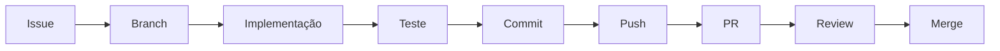

# CONTRIBUTING — como contribuir com o projeto

Linguagem simples de propósito. Ninguém aqui precisa ser especialista em Git.

---

## 1. O fluxo completo



### Issue

Toda tarefa começa por uma issue no GitHub, com um código (`MEM-001`, `X1-003`).
A issue diz o objetivo, os critérios de aceite e o que **não** mexer.

Se a issue não estiver clara, **pergunte antes de começar**. Issue confusa gera
retrabalho.

### Branch

Uma "branch" é uma cópia paralela do projeto onde você trabalha sem atrapalhar
ninguém.

Antes de criar, garanta que você está partindo da versão mais recente:

```bash
git checkout main
git pull
```

Agora crie a sua:

```bash
git checkout -b feat/members-list
```

**Padrão de nome:**

| Prefixo | Quando |
| --- | --- |
| `feat/<nome>` | Funcionalidade nova |
| `fix/<nome>` | Correção de bug |
| `docs/<nome>` | Só documentação |

Use nome curto, **em inglês**, em minúsculas, com hífen. A branch sugerida já
vem na issue — use ela.

Exemplos reais do projeto: `feat/members-list`, `feat/member-profile`,
`feat/x1-form`, `feat/x1-history`, `feat/feedback-form`, `feat/feedback-board`,
`feat/anonymous-feedback-form`, `feat/feedback-moderation`, `feat/member-import`.

Evite branches gigantes como `feat/x1-completo`. Prefira trabalho pequeno e
integrável.

### Implementação

Trabalhe **dentro da pasta da sua feature**. Se precisar mexer em algo
compartilhado, avise antes — ver [ARCHITECTURE.md](ARCHITECTURE.md) → "Fronteiras".

Se estiver usando Claude Code, siga o [AI_DEVELOPMENT_GUIDE.md](AI_DEVELOPMENT_GUIDE.md).

### Teste

Teste **no navegador**, de verdade, antes de abrir o PR. Não basta "compilou".

Confira:

- o caminho principal funciona;
- os quatro estados aparecem: carregando, erro, vazio, com dados;
- funciona em tela pequena (F12 → ícone de celular);
- nada quebrou em outra tela.

Depois rode:

```bash
npm run check
```

Isso roda lint, typecheck, testes e build. **Tem que passar limpo.**

> Se der erro, não desabilite a regra nem use `any` para o erro sumir.
> Corrija a causa, ou peça ajuda.

### Commit

Um commit é um "salvamento" com descrição.

```bash
git add .
git commit -m "feat: listagem de membros com busca e filtro"
```

**Padrão da mensagem:**

```
<tipo>: <o que mudou, em português, no presente>
```

Tipos: `feat`, `fix`, `docs`, `refactor`, `test`, `chore`.

Exemplos bons:

- `feat: formulário de registro de X1`
- `fix: data do X1 aparecia um dia atrasada`
- `docs: exemplos de prompt para Claude Code`

Exemplos ruins: `mudanças`, `wip`, `ajustes finais 2`.

Prefira vários commits pequenos a um commit gigante.

### Push

Enviar sua branch para o GitHub:

```bash
git push -u origin feat/members-list
```

Nas próximas vezes, só `git push`.

### PR (Pull Request)

O PR é o pedido para juntar seu trabalho à `main`.

1. Abra o GitHub — vai aparecer um botão **Compare & pull request**.
2. O template já vem preenchido com as perguntas. **Responda todas.**
3. Coloque print quando a mudança for visual.
4. Marque o reviewer indicado na issue.

### Review

Alguém lê seu código e comenta. Isso é normal e acontece com todo mundo,
inclusive com quem programa há anos.

- Comentário é sobre o código, não sobre você.
- Não entendeu um comentário? Pergunte.
- Discorda? Explique o motivo — pode ser que você esteja certo.

### Merge

Depois de aprovado, o PR entra na `main`. Quem faz o merge é o **Cauan**.

Depois disso, volte para a `main` e atualize:

```bash
git checkout main
git pull
```

---

## 1b. Como o trabalho é organizado no GitHub

### Colunas do Project

```
Backlog → Ready → In Progress → Review → Testing → Done
```

### Labels

Toda issue recebe três:

| Grupo | Valores |
| --- | --- |
| `area:` | `infra` `data` `members` `profile` `x1` `feedback` `anonymous-feedback` `admin` |
| `difficulty:` | `guided` 🟢 · `assisted` 🟡 · `technical` 🔴 |
| `priority:` | `critical` `high` `normal` |

### Quem revisa

Todo PR tem **reviewer técnico** e, nas features, **reviewer funcional**.

| Autor | Reviewer técnico |
| --- | --- |
| Cauan | Sofia |
| Sofia | Cauan |
| Gabi | Cauan |
| Bia | Cauan/Sofia |
| Clara | Cauan/Sofia |

O reviewer funcional é quem é dono do domínio e testa como GG usaria:

```
Código de X1 → review técnico (Cauan/Sofia) → Bia testa como GG
```

### Regra do PR

Um PR resolve **uma coisa principal**. Evite
*"implementei X1, alterei autenticação, refatorei membro e mudei a sidebar"* —
isso trava a revisão e o merge.

---

## 2. Definition of Ready — a issue pode começar?

Uma issue só está pronta para começar quando tem:

- [ ] contexto claro do problema;
- [ ] dependências já concluídas;
- [ ] responsável definido;
- [ ] reviewer definido;
- [ ] resultado esperado descrito;
- [ ] critérios de aceite;
- [ ] limites — o que **não** deve ser alterado;
- [ ] informação suficiente para a pessoa explicar a issue ao Claude Code.

Faltou algo? Peça ao Cauan antes de começar.

---

## 3. Definition of Done — a feature terminou?

Uma feature só está concluída quando tem, quando aplicável:

- [ ] **UI** — a tela existe e segue o design system;
- [ ] **lógica** — o comportamento funciona;
- [ ] **dados** — usa a camada `@/data`, não inventa acesso próprio;
- [ ] **validação** — formulário valida e mostra erro em português;
- [ ] **loading** — estado de carregamento;
- [ ] **erro** — estado de erro, com opção de tentar de novo;
- [ ] **vazio** — estado de lista vazia, explicando o porquê;
- [ ] **integração** — funciona junto com o resto da plataforma;
- [ ] **testes** — regras de negócio cobertas;
- [ ] **review** — PR aprovado;
- [ ] **documentação** — `FEATURES.md` e `BACKLOG.md` atualizados.

"Funciona na minha máquina no caso feliz" não é `Done`.

---

## 4. Evitando conflitos com o time

Cinco pessoas mexendo no mesmo projeto. Estas regras evitam 90% dos problemas:

1. **Fique na sua pasta.** `src/features/<sua-feature>/`.
2. **Não edite o roteador nem a navegação.** Suas rotas já existem.
3. **Não crie componente de UI genérico.** Se falta um, avise.
4. **Não adicione dependência** sem combinar com o Cauan.
5. **Atualize da `main` com frequência:**

```bash
git checkout main
git pull
git checkout sua-branch
git merge main
```

Fazer isso a cada dois dias evita o conflito gigante no fim.

6. **PR pequeno e frequente** é melhor que PR enorme.

---

## 5. Deu conflito. E agora?

Conflito acontece quando duas pessoas mexem na mesma linha. O Git marca assim:

```
<<<<<<< HEAD
código que está na main
=======
código que está na sua branch
>>>>>>> sua-branch
```

**Não tente adivinhar.** Chame o Cauan. Resolver conflito errado apaga o
trabalho de alguém.

Se quiser tentar: escolha a versão certa (ou junte as duas), apague as linhas
`<<<<<<<`, `=======` e `>>>>>>>`, e teste antes de commitar.

---

## 6. Regras que nunca devem ser quebradas

- ❌ Não comite `.env` nem qualquer segredo.
- ❌ Não comite planilha com dado real de membro (`.csv`, `.xlsx`).
- ❌ Não coloque dado pessoal real nos dados de exemplo.
- ❌ Não commite direto na `main`.
- ❌ Não desabilite regra de lint para o erro sumir.
- ❌ Não altere regra de produto sem que isso seja uma decisão combinada —
  ver [PROJECT_CONTEXT.md](PROJECT_CONTEXT.md).

---

## 7. Ajuda rápida de Git

| Situação | Comando |
| --- | --- |
| Em qual branch estou? | `git status` |
| O que eu mudei? | `git diff` |
| Trocar de branch | `git checkout nome-da-branch` |
| Listar branches | `git branch` |
| Desfazer mudança não commitada em um arquivo | `git restore caminho/do/arquivo` |
| Atualizar a main | `git checkout main && git pull` |
| Ver o histórico | `git log --oneline` |

⚠️ Comandos com `--force`, `reset --hard` ou `rebase` podem apagar trabalho.
**Não use sem falar com o Cauan.**
