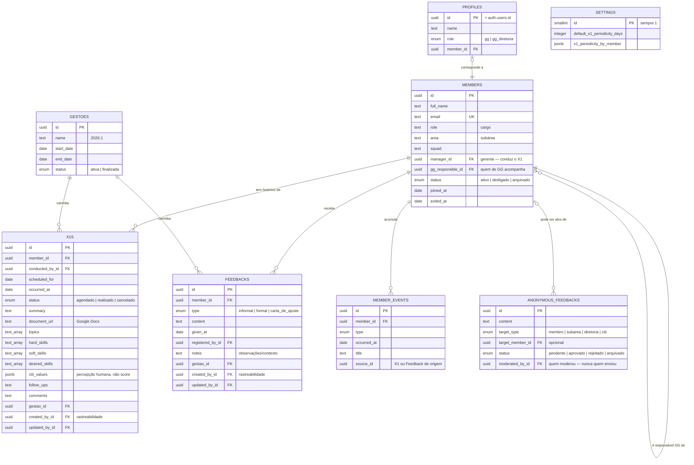
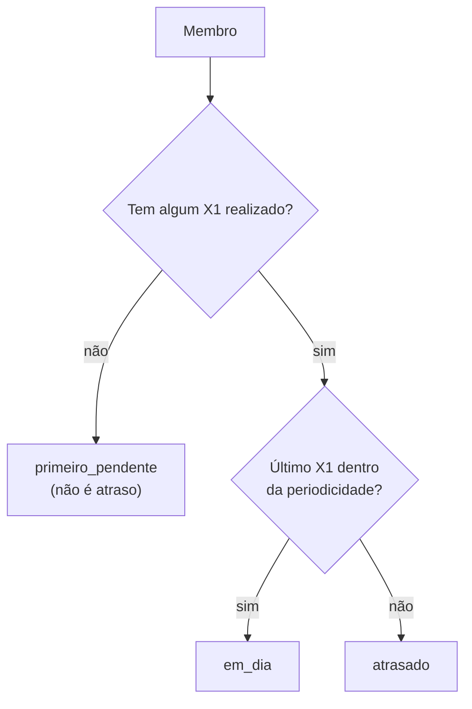
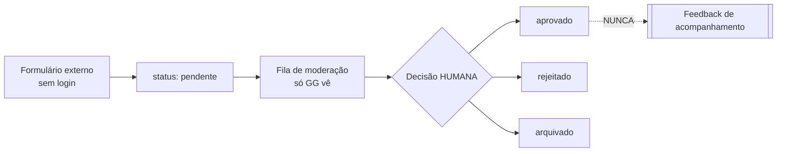

# DATA_MODEL — entidades, relacionamentos e regras

Fonte de verdade em código: `src/data/types.ts`.
Schema do banco: `supabase/migrations/0001_fase1_schema.sql`.

---

## 1. Visão geral



**Repare no que NÃO existe:** não há ligação entre `ANONYMOUS_FEEDBACKS` e
`FEEDBACKS`. É proposital — são fluxos independentes.

---

## 2. Membro

A entidade central. Tudo se relaciona a ela.

### Cardinalidades

| Relação | Cardinalidade |
| --- | --- |
| Membro → X1 | 1 para muitos |
| Membro → Feedback | 1 para muitos (ilimitado) |
| Membro → Evento | 1 para muitos |
| Membro → gerente | muitos para 1 (outro membro) |
| Membro → responsável de GG | muitos para 1 (outro membro) |

### Decisão: posição atual no membro, mudanças em eventos

`area`, `squad`, `role` e `manager_id` guardam o valor **atual** direto na
tabela `members`. As **mudanças** são registradas em `member_events`.

Por quê: quase toda tela precisa da posição atual, e obrigar toda listagem a
fazer junção temporal deixaria o código difícil para quem está começando. Ao
mesmo tempo, a regra "não sobrescreva o passado" continua valendo — o evento
preserva o histórico.

Na prática, `updateMember()` cria o evento automaticamente quando `area` ou
`role` mudam. Você não precisa lembrar de fazer isso.

### Ciclo de vida

| Status | Significado |
| --- | --- |
| `ativo` | Membro atual do CITi |
| `desligado` | Saiu; histórico preservado |
| `arquivado` | Fora das listagens; histórico preservado |

**Não existe exclusão.** `archiveMember()` é a operação disponível.

---

## 3. X1

### Estados de um REGISTRO de X1

`agendado` → `realizado` (ou `cancelado`).

O banco garante: um X1 `realizado` obrigatoriamente tem `occurred_at`.

### Situação do MEMBRO — calculada, nunca gravada

Isto é diferente do estado do registro, e a confusão entre os dois é o erro mais
comum nesta parte do modelo.



```ts
import { getMemberX1Status, useSettings, useX1sByMember } from '@/data';

const status = getMemberX1Status(member, x1s, settings);
// 'primeiro_pendente' | 'em_dia' | 'atrasado'
```

**Nunca grave "atrasado" em uma coluna.** Isso ficaria desatualizado no dia
seguinte e faria a plataforma mentir sobre a situação de uma pessoa.

### Os seis estados do produto, no código

O documento de contexto lista seis estados relevantes. Eles vivem em dois eixos
diferentes — misturá-los é o erro mais comum nesta parte do modelo:

| Estado do produto | Onde vive |
| --- | --- |
| Agendado · Realizado | `X1.status` — situação do **registro** |
| Primeiro X1 pendente · Em dia · Atrasado | `getMemberX1Status()` — situação do **membro**, calculada |
| Não agendado | `nextScheduledX1(x1s) === null` |

### Campos do registro

O documento de contexto define o que um X1 registra. Todos existem no modelo:

| Campo | Tipo | Observação |
| --- | --- | --- |
| `occurredAt` / `scheduledFor` | data | |
| `conductedById` | membro | quem conduziu |
| `documentUrl` | texto | **Google Docs** com a transcrição |
| `summary` | texto | resumo |
| `topics` | lista | principais pontos |
| `hardSkills` | lista | hard skills citadas |
| `softSkills` | lista | soft skills citadas |
| `desiredSkills` | lista | o que a pessoa quer desenvolver — alimenta o futuro PDI |
| `followUps` | texto | encaminhamentos |
| `citiValues` | lista de `{value, rating, note}` | avaliação dos valores do CITi |
| `comments` | texto | comentários relevantes |
| `gestaoId` | gestão | preserva o contexto da época |

⚠️ **`citiValues` é percepção humana registrada, não score.** Não derive
classificação de engajamento dela na Fase 1 — engScore é Fase 2 e configurável
por gestão.

Os quatro valores estão em `CITI_VALUES`: *Eu sou o CITi · Obcecados por
aprender · Obcecados por vencer · Obcecados por entregar*.

### Periodicidade

- Padrão: `settings.defaultX1PeriodicityDays` (o CITi usa **30**).
- Exceção por membro: `settings.x1PeriodicityByMember[memberId]`.
- Use `x1PeriodicityFor(memberId, settings)` — ele já resolve a precedência.

---

## 4. Feedback de acompanhamento

Três tipos, definidos pelo produto:

| Tipo | Valor no código |
| --- | --- |
| Informal | `informal` |
| Formal | `formal` |
| Carta de Ajuste | `carta_de_ajuste` |

**Ilimitados por membro.** Não existem "slots". Se alguém pedir campos como
"FI1" e "FI2", isso contraria a regra de produto — ver
[PROJECT_CONTEXT.md](PROJECT_CONTEXT.md) §4.3.

Criar um feedback gera automaticamente um evento na timeline do membro.

---

## 5. Feedback Anônimo

⚠️ **Fluxo independente.** Leia com atenção antes de mexer.



Regras estruturais:

1. **Nenhuma coluna identifica quem enviou.** Não há `author`, `email`, `ip`.
   O anonimato vem da ausência do campo, não de uma regra de exibição.
   `moderated_by_id` é quem **moderou**, nunca quem enviou.
2. **Não existe conversão.** Nenhuma função em `src/data/anonymousFeedback.ts`
   cria um `Feedback`, e nenhuma deve passar a existir. Há um teste que garante
   isso (`mockAdapter.test.ts`).
3. **A decisão é humana.** Nada aprova ou classifica sozinho.
4. O alvo pode ser um membro, uma subárea, a diretoria ou o CITi.
   O banco garante que `target_member_id` só é preenchido quando o alvo é membro.

Acesso no Supabase (RLS): **qualquer pessoa insere**, **só GG lê e modera**.

---

## 6. Eventos do membro (timeline)

Tabela **append-only**: registros são criados, nunca alterados.

| Tipo | Quando é criado |
| --- | --- |
| `entrada` | Ao cadastrar o membro |
| `mudanca_area` | Ao mudar a subárea |
| `mudanca_cargo` | Ao mudar o cargo |
| `mudanca_gerente` | Ao mudar o gerente |
| `x1` | Ao registrar um X1 como realizado |
| `feedback` | Ao registrar um feedback |
| `desligamento` | Ao desligar o membro |
| `observacao` | Registro manual |

A camada de dados cria esses eventos sozinha. Alimenta `PERFIL-004` (Timeline).

---

## 6b. Gestões

A plataforma atravessa gestões, e isso é **requisito estrutural** do produto:

> Uma regra configurável não deve apagar a interpretação do passado.

Na Fase 1 a entidade `Gestao` é mínima — id, nome (`2026.1`), período e status.
Serve para **carimbar** X1 e Feedback com a gestão em que aconteceram.

```ts
const { data: gestao } = useCurrentGestao();
createX1({ ...campos, gestaoId: gestao?.id ?? null });
```

O banco garante que só existe **uma gestão ativa** por vez.

⚠️ O módulo completo de gestões — metas, indicadores, passagem de gestão — é
evolução futura. Não construa agora. Ver ADR-012.

---

## 6c. Rastreabilidade

Registros relevantes guardam **quem criou, quando, quem alterou e quando**:

| Campo | Significado |
| --- | --- |
| `createdById` / `updatedById` | quem **digitou** o registro na plataforma |
| `createdAt` / `updatedAt` | quando — preenchidos automaticamente |

Não confunda com os campos semânticos: `conductedById` é quem **conduziu** o X1,
`registeredById` é quem **deu** o feedback. Uma pessoa pode registrar na
plataforma um X1 conduzido por outra.

Em `anonymous_feedbacks`, `moderatedById` é quem **moderou** — nunca quem
enviou. Ver §5.

---

## 7. Configurações

Tabela de **linha única** (`id = 1`). Guarda só o que a Fase 1 precisa:
periodicidade padrão de X1, exceções por membro e a gestão corrente
(`currentGestaoId`).

---

## 8. Perfis e acesso

`profiles` é a lista de quem pode entrar na plataforma.

Ter conta no Supabase Auth **não é suficiente**: sem linha em `profiles`, o
login é recusado com uma mensagem clara. É assim que a GG controla o acesso sem
existir autorregistro.

---

## 9. Convenções

| Assunto | Convenção |
| --- | --- |
| Identificadores | `uuid` no banco, `string` no TypeScript |
| Datas de calendário | `date` no banco, ISO `'2026-03-15'` no código |
| Datas com hora | `timestamptz`, ISO completo |
| Nomes de coluna | `snake_case` no banco, `camelCase` no código |
| Tradução entre os dois | `src/data/supabase/mappers.ts` |
| Textos vazios | `null`, nunca `''` |

---

## 10. Como mudar o modelo

Uma mudança de schema anda com **quatro** arquivos. Fazer só um deles faz o modo
mock e o real divergirem — e o bug só aparece na integração.

1. `supabase/migrations/000X_*.sql` — migration nova (nunca edite uma aplicada)
2. `src/data/types.ts` — o tipo
3. `src/data/mock/mockAdapter.ts` (+ `fixtures.ts`)
4. `src/data/supabase/mappers.ts` e `supabaseAdapter.ts`

**Responsável: Sofia.** Não faça isso sozinho em uma branch de feature — abra a
conversa antes.
