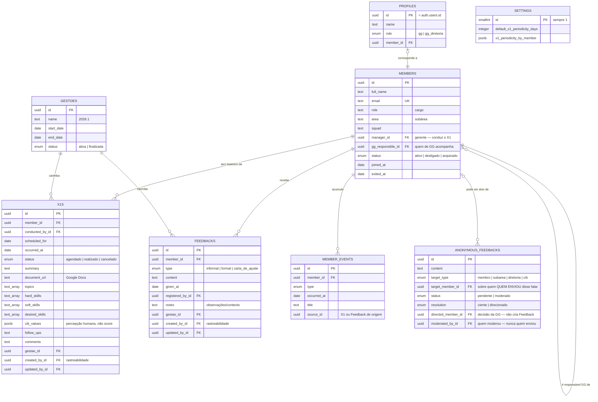
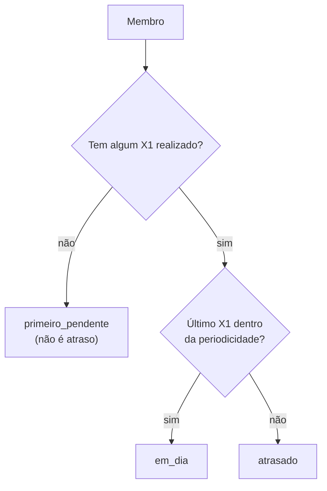
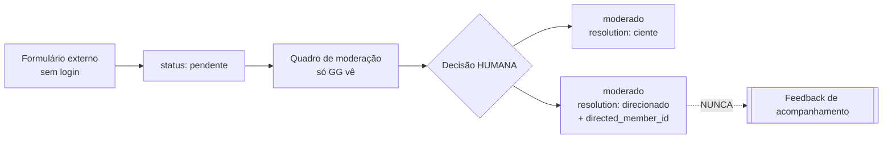

# DATA_MODEL — entidades, relacionamentos e regras

Fonte de verdade em código: `src/data/types.ts`.
Schema do banco: `supabase/migrations/0001_fase1_schema.sql`.

---

## 1. Visão geral



**Repare no que NÃO existe:** não há ligação entre `ANONYMOUS_FEEDBACKS` e
`FEEDBACKS`. É proposital — são fluxos independentes.

---

## 2. Membro

A entidade central. Tudo se relaciona a ela.

### Cardinalidades

| Relação | Cardinalidade |
| --- | --- |
| Membro → X1 | 1 para muitos |
| Membro → Feedback | 1 para muitos (ilimitado) |
| Membro → Evento | 1 para muitos |
| Membro → gerente | muitos para 1 (outro membro) |
| Membro → responsável de GG | muitos para 1 (outro membro) |

### Decisão: posição atual no membro, mudanças em eventos

`area`, `squad`, `role` e `manager_id` guardam o valor **atual** direto na
tabela `members`. As **mudanças** são registradas em `member_events`.

Por quê: quase toda tela precisa da posição atual, e obrigar toda listagem a
fazer junção temporal deixaria o código difícil para quem está começando. Ao
mesmo tempo, a regra "não sobrescreva o passado" continua valendo — o evento
preserva o histórico.

Na prática, `updateMember()` cria o evento automaticamente quando `area` ou
`role` mudam. Você não precisa lembrar de fazer isso.

### Ciclo de vida

| Status | Significado |
| --- | --- |
| `ativo` | Membro atual do CITi |
| `desligado` | Saiu; histórico preservado |
| `arquivado` | Fora das listagens; histórico preservado |

**Não existe exclusão.** `archiveMember()` é a operação disponível.

---

## 3. X1

### Estados de um REGISTRO de X1

`agendado` → `realizado` (ou `cancelado`).

O banco garante: um X1 `realizado` obrigatoriamente tem `occurred_at`.

### Situação do MEMBRO — calculada, nunca gravada

Isto é diferente do estado do registro, e a confusão entre os dois é o erro mais
comum nesta parte do modelo.



```ts
import { getMemberX1Status, useSettings, useX1sByMember } from '@/data';

const status = getMemberX1Status(member, x1s, settings);
// 'primeiro_pendente' | 'em_dia' | 'atrasado'
```

**Nunca grave "atrasado" em uma coluna.** Isso ficaria desatualizado no dia
seguinte e faria a plataforma mentir sobre a situação de uma pessoa.

#### Na listagem, sem uma consulta por pessoa

O Perfil tem o histórico completo de uma pessoa e usa `getMemberX1Status()`. A
listagem precisa da situação de todo mundo ao mesmo tempo — pedir o histórico de
cada um seria uma consulta por linha (N+1).

Para isso existe uma leitura dedicada:

```ts
import { memberX1StatusFrom, useLastCompletedX1ByMember, useSettings } from '@/data';

const { data: lastX1 } = useLastCompletedX1ByMember(); // uma consulta só
const status = memberX1StatusFrom(lastX1?.[member.id], periodicidade);
```

`db.x1.listLastCompletedByMember()` devolve o último X1 **realizado** de cada
membro. No Postgres é um `distinct on (member_id)`; no mock é uma varredura.

`getMemberX1Status()` delega para `memberX1StatusFrom()`, então as duas telas
aplicam literalmente a mesma regra e não podem divergir.

#### Outras coisas derivadas do mesmo histórico

| Derivado | Função | Observação |
| --- | --- | --- |
| Último X1 | `lastCompletedX1(x1s)` | só `realizado` com `occurredAt` |
| Próximo agendado | `nextScheduledX1(x1s)` | `null` = não agendado |
| Próximo recomendado | `nextRecommendedX1Date(x1s, dias)` | `null` quando o próximo é o primeiro |
| Periodicidade da pessoa | `x1PeriodicityFor(id, settings)` | exceção ou padrão |

Nenhum deles tem coluna no banco. **Não crie.**

### Os seis estados do produto, no código

O documento de contexto lista seis estados relevantes. Eles vivem em dois eixos
diferentes — misturá-los é o erro mais comum nesta parte do modelo:

| Estado do produto | Onde vive |
| --- | --- |
| Agendado · Realizado | `X1.status` — situação do **registro** |
| Primeiro X1 pendente · Em dia · Atrasado | `getMemberX1Status()` — situação do **membro**, calculada |
| Não agendado | `nextScheduledX1(x1s) === null` |

### Campos do registro

O documento de contexto define o que um X1 registra. Todos existem no modelo:

| Campo | Tipo | Observação |
| --- | --- | --- |
| `occurredAt` / `scheduledFor` | data | |
| `conductedById` | membro | quem conduziu |
| `documentUrl` | texto | **Google Docs** com a transcrição |
| `summary` | texto | resumo |
| `topics` | lista | principais pontos |
| `hardSkills` | lista | hard skills citadas |
| `softSkills` | lista | soft skills citadas |
| `desiredSkills` | lista | o que a pessoa quer desenvolver — alimenta o futuro PDI |
| `followUps` | texto | encaminhamentos |
| `citiValues` | lista de `{value, rating, note}` | avaliação dos valores do CITi |
| `comments` | texto | comentários relevantes |
| `gestaoId` | gestão | preserva o contexto da época |

⚠️ **`citiValues` é percepção humana registrada, não score.** Não derive
classificação de engajamento dela na Fase 1 — engScore é Fase 2 e configurável
por gestão.

### Os valores do CITi são editáveis (ADM-004)

A lista viva é `settings.citiValues` — `[{ id, label, retiredAt }]` — e a
Administração acrescenta e aposenta itens nela (renomear não existe).

Sem nenhuma lista configurada, `activeCitiValues()` devolve `CITI_VALUE_SEED` —
os quatro fundadores, com os ids que a 0038 grava. É a rede para o banco que
ainda não recebeu a migration: melhor mostrar os quatro do que deixar o X1 sem
seção de valores, que é uma falha silenciosa. `CITI_VALUES` continua no código, mas só como **semente**
de 2026 (migration 0038 e fixtures): ler dela em tempo de execução mostra a
lista errada. Use `activeCitiValues(settings)`.

⚠️ **A avaliação gravada num X1 é um SNAPSHOT, não uma referência.**

```ts
citiValues: [{ valueId: 'ae3a…', value: 'Eu sou o CITi', rating: 4, note: null }]
```

`value` guarda o rótulo **do dia da conversa**. É isso que faz aposentar um
valor não reescrever nenhum X1 antigo. `valueId` viaja ao lado só para ligar o
registro ao valor atual quando ele ainda existe — é opcional, porque registro
anterior à ADM-004 pode não ter.

Um valor nunca é removido da lista: ele é **aposentado** (`retiredAt`), some do
formulário de X1 novo e continua legível no histórico. Ver ADR-023.

### Periodicidade

- Padrão: `settings.defaultX1PeriodicityDays` (o CITi usa **30**), editável na
  Administração (ADM-001).
- Exceção por membro: `settings.x1PeriodicityByMember[memberId]`.
- Use `x1PeriodicityFor(memberId, settings)` — ele já resolve a precedência.

⚠️ Mudar o padrão vale **na hora e para o passado também**: a situação de X1 é
derivada, então ela é sempre "segundo a regra de hoje". Nenhum X1 gravado muda.
É o outro lado da ADR-023 — regra viva aqui, snapshot nos valores.

---

## 4. Feedback de acompanhamento

Três tipos, definidos pelo produto:

| Tipo | Valor no código |
| --- | --- |
| Informal | `informal` |
| Formal | `formal` |
| Carta de Ajuste | `carta_de_ajuste` |

**Ilimitados por membro.** Não existem "slots". Se alguém pedir campos como
"FI1" e "FI2", isso contraria a regra de produto — ver
[PROJECT_CONTEXT.md](PROJECT_CONTEXT.md) §4.3.

Criar um feedback gera automaticamente um evento na timeline do membro.

---

## 5. Feedback Anônimo

⚠️ **Fluxo independente.** Leia com atenção antes de mexer.



### Dois eixos, não três estados

O erro mais fácil de cometer aqui é achatar tudo em uma lista de estados. São
duas perguntas diferentes:

| Pergunta | Onde vive |
| --- | --- |
| Isto ainda precisa da GG? | `status` — `pendente` ou `moderado` |
| O que a GG decidiu? | `resolution` — `ciente` ou `direcionado` |

O quadro de moderação **deriva** suas três colunas dessa combinação
(`features/anonymous-feedback/model/moderationBoard.ts`). Não existe coluna
"coluna" no banco, e não deve passar a existir — é o que garante que o quadro
nunca discorde do registro.

```text
status 'pendente'         → Pendentes
resolution 'direcionado'  → Direcionados
resolution 'ciente'       → Cientes
```

### `target_member_id` ≠ `directed_member_id`

Confundir os dois é o segundo erro fácil.

| Campo | Significa | Quem preencheu |
| --- | --- | --- |
| `target_member_id` | sobre quem o relato diz falar | quem **enviou**, no formulário |
| `directed_member_id` | a quem o contexto foi levado | a **GG**, ao moderar |

Um relato sobre a subárea pode acabar direcionado à gerência dela; um relato
sobre uma pessoa pode acabar apenas como "ciente", sem direcionamento nenhum.
O banco garante que `directed_member_id` só existe quando
`resolution = 'direcionado'`.

Regras estruturais:

1. **Nenhuma coluna identifica quem enviou.** Não há `author`, `email`, `ip`.
   O anonimato vem da ausência do campo, não de uma regra de exibição.
   `moderated_by_id` é quem **moderou**, nunca quem enviou.
2. **Não existe conversão.** Nenhuma função em `src/data/anonymousFeedback.ts`
   cria um `Feedback`, e nenhuma deve passar a existir. Dois testes garantem
   isso: `mockAdapter.test.ts` (camada de dados) e `feedbacksFlow.test.tsx`
   (fluxo completo — direcionar não muda contagem de acompanhamento nenhuma).
3. **A decisão é humana.** Nada toma ciência nem direciona sozinho, e
   direcionar exige escolher a pessoa em um passo explícito.
4. O alvo pode ser um membro, uma subárea, a diretoria ou o CITi.
   O banco garante que `target_member_id` só é preenchido quando o alvo é membro.
5. **Não é "aprovar/rejeitar".** Não existe publicação a aprovar — ver ADR-013.

Acesso no Supabase (RLS): **qualquer pessoa insere**, **só GG lê e modera**.

---

## 6. Eventos do membro (timeline)

Tabela **append-only**: registros são criados, nunca alterados.

| Tipo | Quando é criado |
| --- | --- |
| `entrada` | Ao cadastrar o membro |
| `mudanca_area` | Ao mudar a subárea |
| `mudanca_cargo` | Ao mudar o cargo |
| `mudanca_gerente` | Ao mudar o gerente |
| `x1` | Ao registrar um X1 como realizado |
| `feedback` | Ao registrar um feedback |
| `desligamento` | Ao desligar o membro |
| `observacao` | Registro manual |

A camada de dados cria esses eventos sozinha. Alimenta `PERFIL-004` (Timeline).

---

## 6b. Gestões

A plataforma atravessa gestões, e isso é **requisito estrutural** do produto:

> Uma regra configurável não deve apagar a interpretação do passado.

Na Fase 1 a entidade `Gestao` é mínima — id, nome (`2026.1`), período e status.
Serve para **carimbar** X1 e Feedback com a gestão em que aconteceram.

```ts
const { data: gestao } = useCurrentGestao();
createX1({ ...campos, gestaoId: gestao?.id ?? null });
```

O banco garante que só existe **uma gestão ativa** por vez.

⚠️ O módulo completo de gestões — metas, indicadores, passagem de gestão — é
evolução futura. Não construa agora. Ver ADR-012.

---

## 6c. Rastreabilidade

Registros relevantes guardam **quem criou, quando, quem alterou e quando**:

| Campo | Significado |
| --- | --- |
| `createdById` / `updatedById` | quem **digitou** o registro na plataforma |
| `createdAt` / `updatedAt` | quando — preenchidos automaticamente |

Não confunda com os campos semânticos: `conductedById` é quem **conduziu** o X1,
`registeredById` é quem **deu** o feedback. Uma pessoa pode registrar na
plataforma um X1 conduzido por outra.

Em `anonymous_feedbacks`, `moderatedById` é quem **moderou** — nunca quem
enviou. Ver §5.

---

## 7. Configurações

Tabela de **linha única** (`id = 1`). Guarda só o que a Fase 1 precisa:
periodicidade padrão de X1, exceções por membro e a gestão corrente
(`currentGestaoId`).

---

## 8. Perfis e acesso

`profiles` é a lista de quem pode entrar na plataforma.

Ter conta no Supabase Auth **não é suficiente**: sem linha em `profiles`, o
login é recusado com uma mensagem clara. É assim que a GG controla o acesso sem
existir autorregistro.

---

## 8b. Gestão de membros — estrutura, ciclo e entrada

Acrescentado pelas migrations `0003`–`0010`. Passo a passo de aplicação,
premissas e comandos: **`docs/supabase-test-setup.md`**.

### Estrutura organizacional

`areas` → `subareas` → `positions`. Substitui, sem remover, o texto livre de
`members.area` e `members.role`: as colunas novas (`area_id`, `subarea_id`,
`position_id`) convivem com as antigas enquanto as telas não migram.

Duas decisões que valem lembrar:

- **Cargo de área inteira.** `positions.subarea_id` nulo significa que o cargo
  atua sobre a área toda. É o que faz "Diretoria de Negócios" cobrir Comercial
  e Marketing sem existirem duas linhas dela.
- **Membro sem subárea (0014).** Quem tem cargo de área inteira fica com
  `members.subarea_id` **NULO, sempre** — inclusive quando a planilha informou
  uma subárea válida, que é conferida (precisa ser da área do cargo) e depois
  descartada. Prender a Diretoria de Negócios ao Comercial inventaria um
  vínculo que não existe. `area_id` vem do cargo; o valor recebido continua no
  `payload` da submissão. Não gera erro nem `needs_review`: a prévia mostra um
  aviso informativo e segue. Cargo preso a uma subárea continua exigindo
  subárea — sem ela ninguém saberia em que time a pessoa entrou. A pessoa é
  **uma só**: não existe uma linha por subárea coberta.
- **Filtros e listagens usam as chaves, não o texto.** `area_id` recorta a área
  inteira (e traz quem não está em subárea nenhuma); `subarea_id` recorta só a
  subárea, e a diretoria de área não aparece nele porque não pertence a uma
  subárea só. A coluna `members.area` fica **apenas** por compatibilidade, para
  o cadastro manual que ainda não lê o catálogo — remoção registrada em
  **DATA-007**.
- **Regra de continuação armazenada.** `positions.continuation_months` (12 para
  diretoria, 6 para o resto). O código **nunca** compara o nome do cargo com a
  palavra "diretoria" — ele lê a coluna.
- **Um cargo, vários nomes (0017 e 0018).** `position_aliases` guarda os
  apelidos de um cargo, e `positions.abbreviation` guarda a sigla. As quatro
  diretorias são **cadeiras únicas**, todas de escopo de **área inteira**
  (`subarea_id` nulo), `is_directorship` e **12 meses**:

  | Sigla | Nome canônico | Área | Apelidos que resolvem |
  | --- | --- | --- | --- |
  | CEO | Diretor(a) Institucional | Institucional | Presidência, Diretoria Institucional, Diretor(a)/Diretora Institucional |
  | COO | Diretor(a) de Operações | Gente e Gestão | Diretoria de Gente e Gestão, Diretor(a)/Diretora de Operações, Diretoria de Operações |
  | CRO | Diretor(a) de Negócios | Negócios | Diretoria de Negócios, Diretor/Diretora de Negócios |
  | CTO | Diretor(a) de Soluções | Soluções | Diretoria de Soluções, Diretor/Diretora de Soluções |

  **Customer Success** (0018) também cobre a área de Soluções inteira, no mesmo
  nível dos Líderes — mas **não é diretoria**: 6 meses de continuação, como
  qualquer cargo não diretivo. Área inteira e diretoria são coisas diferentes, e
  confundi-las daria 12 meses a quem a gestão deu 6. Ele não lidera ninguém
  hoje; isso é um fato do momento, e **não** existe proibição de liderados.

  **Cargo de área inteira nunca é cargo de ENTRADA** (0018). A chave composta
  `subareas_entry_position_da_propria_subarea` exige que o cargo de chegada seja
  da própria subárea — é o que impede a futura integração do Google Forms de
  atribuir uma diretoria ou o Customer Success sozinha. Ninguém entra na
  empresa como CTO.

  Dois cargos equivalentes no catálogo não é detalhe: é a mesma pessoa
  importada num ou noutro conforme o que a planilha escreveu naquele semestre,
  duas linhas no seletor, e filtro por cargo devolvendo metade da resposta.

  Quem resolve texto → cargo é `citi_resolve_position(rótulo, área)` no banco e
  `findPositionsByLabel()` no TypeScript; os dois normalizam igual (minúsculas,
  sem acento, espaços colapsados). Um apelido pertence a **um** cargo só,
  garantido por índice único.
- **Cargo inicial por chave estrangeira.** `subareas.entry_position_id` diz com
  que cargo entra quem chega naquela subárea. Não é texto comparado em lugar
  nenhum.

### Situação do membro

`member_status` passou a ter quatro valores:

| Status | Significado |
| --- | --- |
| `ativo` | está atualmente na empresa |
| `inativo` | **terminou naturalmente** o ciclo |
| `desligado` | saiu **antes** de terminar o ciclo |
| `arquivado` | mantido apenas para histórico |

A diferença entre `inativo` e `desligado` não é cosmética: só quem ficou inativo
por conclusão natural pode ser reativado.

### Ciclos (`member_cycles`)

⚠️ **Gestão ≠ ciclo.** A gestão `2026.2` é o semestre administrativo
(01/07/2026 – 31/12/2026). O ciclo de quem entra nela dura **12 meses**
(01/07/2026 – 30/06/2027).

| Entrada | Ciclo |
| --- | --- |
| `AAAA.1` | 01/01/AAAA → 31/12/AAAA |
| `AAAA.2` | 01/07/AAAA → 30/06/(AAAA+1) |

Calculado por `citi_cycle_bounds()`. Um membro tem no máximo um ciclo
`em_andamento` (índice único parcial garante). Continuação **emenda**: o novo
ciclo abre no dia seguinte ao fim do anterior, com `origin = 'continuacao'`.

O ciclo é vigente durante **todo** o `expected_end_on`: só está vencido quando
`expected_end_on < data de referência`.

**Como um ciclo termina** (`end_type`):

| Valor | Significado |
| --- | --- |
| `conclusao_natural` | chegou ao fim previsto e a pessoa ficou inativa. É o único fim que a reativação aceita |
| `continuado` | chegou ao fim previsto e **a pessoa seguiu** — o ciclo seguinte emenda no dia seguinte. Introduzido pela `0015` |
| `desligamento` | saiu antes do fim |
| `arquivamento` | foi para histórico |

**`member_cycles.source` (0015).** Responde outra pergunta que não a `origin`:
quem criou aquele período. `NULL` é o normal — entrada, ou continuação que
alguém decidiu. `current_roster_import` marca o ciclo que a importação da base
atual **deduziu**, e que ninguém assinou.

### A base atual (`current_roster`, migration 0015)

⚠️ **A planilha da importação é a BASE ATUAL, não um arquivo de entradas.** Ela
descreve quem está no CITi **hoje**. Quem entrou em 2024.1 e continua atuando
não "concluiu o ciclo e saiu" — continuou, e ninguém registrou porque a
plataforma não existia.

Por isso a importação nunca inativa ninguém. Quando o ciclo da gestão de entrada
já terminou antes da data de referência:

1. o ciclo inicial (que **não** se estica) é encerrado como `continuado`;
2. abre-se um ciclo no dia seguinte, com `continuation_months` do **cargo**
   (12 diretoria, 6 demais — lido da coluna);
3. repete-se até um ciclo alcançar a data de referência;
4. só o último fica `em_andamento`, e o membro fica `ativo` o tempo todo;
5. nenhum desligamento, retorno ou reativação é registrado — nada disso houve;
6. os ciclos inferidos ficam com `source = 'current_roster_import'`;
7. tudo isso vira **um único** `member_event` de `importacao`, com fim original,
   fim final, quantidade de ciclos, meses de cada bloco e data de referência. O
   detalhamento de cada período vive nos `member_cycles`.

**A data de referência é do BANCO** (`citi_import_reference_date`). A prévia
calcula no navegador para mostrar as datas sem uma ida ao servidor por linha,
mas quem decide quantos meses cada pessoa ganha não pode ser o relógio do
cliente: pela API a sugestão é substituída pela data do servidor, e uma sugestão
a mais de um dia de distância é recusada (prévia velha). O valor usado volta no
resultado da importação.

**Não existe renovação automática depois disso.** Quando o último ciclo
terminar, a rotina diária inativa o membro normalmente, por
`conclusao_natural` — a continuação seguinte é decisão humana, pela reativação.

A entrada futura pelo **Google Forms não usa a base atual**: `citi_open_entry_cycle`
cria só o ciclo inicial, porque quem está chegando agora não tem histórico a
reconstruir.

### As duas operações

| Função | O que faz |
| --- | --- |
| `citi_deactivate_finished_cycles(data)` | quem está `ativo` com ciclo vencido vira `inativo`. Idempotente; não toca em desligado nem arquivado |
| `citi_reactivate_member(membro, cargo, …)` | continuação: só para quem está `inativo` por conclusão natural. Os meses vêm de `continuation_months` |

### Histórico (`member_events`)

Ganhou `before_data` / `after_data` (JSONB), `actor_profile_id` e
`idempotency_key`. Mudança de cargo, área, subárea, responsável de GG, saída e
**correção cadastral** são registradas por **trigger**, não pela tela — confiar
na tela para lembrar de registrar é como o passado acaba sobrescrito.

**Correção cadastral ≠ mudança (0016).** Corrigir um telefone digitado errado
não é a mesma coisa que o telefone da pessoa ter mudado. O tipo
`correcao_cadastral` guarda o **diff** — só os campos que mudaram, com antes e
depois — e um único evento por correção, mesmo quando três campos são
corrigidos de uma vez.

Os eventos de cargo, área e subárea carregam `change_kind` em `after_data`:
`correcao_cadastral` quando vieram da tela de correção, `nao_informado` quando
ninguém declarou. É o que vai separar conserto de cadastro de uma futura
**movimentação** formal (promoção, troca de time, com data de vigência) — ver
ADR-015. Quem chama declara com `set local citi.change_kind`.

### Correção de cadastro (`0016`, PERFIL-006)

| Função | O que faz |
| --- | --- |
| `citi_correct_member_record(membro, mudanças)` | corrige o cadastro numa transação. `mudanças` é JSONB com **apenas as chaves alteradas**; chave ausente não mexe, chave nula limpa. Chave desconhecida é **recusada** |
| `citi_resolve_member_review(membro, motivos)` | remove do `needs_review` **só** os motivos informados e devolve os que sobraram |

O que a correção valida: e-mail institucional único (sem depender da caixa),
telefone guardado **só com dígitos**, data de nascimento real e não futura,
período entre 1 e 20, e a lotação inteira de uma vez — cargo de área inteira
zera a subárea, e a área sai do cargo, exatamente como na importação.

O que ela **não** toca, de propósito: `status`, `joined_at`, `exited_at` (sair e
voltar têm fluxo próprio), `gg_responsible_id` (tela e evento próprios), foto
(vai para o Storage, que não participa da transação) e CPF (exige modelagem de
segurança própria).

Corrigir a data de nascimento resolve `invalid_birth_date` **e só ela**; enviar
a foto resolve as pendências `photo_*`. Quando o último motivo sai, a submissão
volta sozinha para `processed`.

### Entrada de pessoas (`member_intake_submissions`)

Planilha e Google Forms escrevem aqui antes de virar membro: guarda o payload
original, o status (`pending` / `processed` / `needs_review` / `failed`) e um
`external_id` único por origem, que impede processar o mesmo envio duas vezes.

A importação por **CSV já está implementada** (migrations 0011 a 0015, tela em
`/importacao`, passo a passo em `docs/importacao-piloto.md`). O Google Forms
continua sendo só o lugar onde ela vai escrever.

| Função | O que faz |
| --- | --- |
| `citi_import_member(...)` | submissão + membro + ciclo + continuação da base atual + histórico numa transação. Ninguém entra inativo. Idempotente por `(csv, external_id)` e por e-mail |
| `citi_continue_roster_cycles(membro, data)` | emenda os ciclos de continuação da base atual até alcançar a data de referência. Encerra os anteriores como `continuado` |
| `citi_import_reference_date(data)` | a data de referência oficial: a do banco. Sessão direta pode fixá-la; pela API, sugestão distante é recusada |
| `citi_record_intake_failure(...)` | deixa rastro de uma linha que falhou — a transação dela já voltou atrás |
| `citi_flag_intake_review(...)` | marca uma submissão já importada como `needs_review`, com os motivos. Lista vazia devolve para `processed` |
| `org_positions_catalog` (view) | combinações válidas de área × subárea × cargo, uma linha por par permitido |

**Pendência de revisão (`review_reasons`, migration 0013).** Existe um terceiro
destino além de "entrou" e "não entrou": a pessoa entra corretamente e ainda
sobra algo para um humano resolver. `review_reasons` é `text[]` com **códigos
estáveis** — `invalid_birth_date`, `photo_missing`, `invalid_photo_type`,
`photo_too_large`, `photo_upload_failed` — e a tradução para português vive na
tela, não no banco.

- Status e motivos andam juntos, garantido por `check`: ter motivo **é** estar
  em `needs_review`; não ter motivo **é** não estar. Tirar o último motivo
  devolve a submissão para `processed` sozinho.
- `error_message` continua reservado para **falha técnica**. Pendência de
  revisão não é erro.
- O valor original que a planilha trouxe **não** é copiado para cá: ele já está
  em `payload`, fiel ao arquivo.
- Reimportar não apaga uma pendência: `needs_review` conta como "já importado"
  na primeira camada de idempotência.

⚠️ Hoje não existe tela para resolver essas pendências — a correção do cadastro
pelo Perfil é **PERFIL-006**, obrigatória antes da importação da base real.

⚠️ A importação usa o cargo **da planilha**, não `subareas.entry_position_id`:
quem já está no CITi pode ser analista, especialista, gerente, líder ou diretor.
O cargo inicial é para as entradas futuras pelo Google Forms.

### Fotos

Bucket **privado** `member-photos`, organizado por `<member_id>/<arquivo>`,
5 MB, JPEG/PNG/WebP. Sem link público permanente: a exibição usa URL assinada.
`members.photo_path` guarda o caminho.

**Como a foto chega à tela.** `db.members.getPhotoUrl(caminho)` pede uma URL
assinada de uma hora; `useMemberPhotoUrl` guarda essa URL em cache **por
caminho**, com validade um pouco menor que a da assinatura. A listagem de
setenta pessoas pede setenta URLs — não uma por renderização.

- A URL assinada **nunca** é gravada no banco. Ela expira, e link morto
  guardado é pior do que nenhum.
- Sem foto, foto apagada do bucket e assinatura vencida têm a mesma resposta:
  as **iniciais**. Quadrado quebrado no lugar do rosto de alguém, nunca.
- Assinatura vencida (aba aberta desde ontem) faz a imagem falhar; o
  `MemberAvatar` invalida o cache daquele caminho e pede outra.
- O caminho é conferido contra `<uuid>/<arquivo>` antes de virar pedido de
  assinatura: um `photo_path` adulterado não vira URL de outro bucket.

---

## 8c. Autorização e dado privado (migration 0019)

### Quem entra

`citi_is_gg()` confere o **papel**, contra uma lista fechada:

```sql
select exists (select 1 from profiles p
                where p.id = auth.uid() and p.role in ('gg','gg_diretoria'));
```

⚠️ Antes da `0019` era `exists (select 1 from profiles where id = auth.uid())` —
**qualquer** linha em `profiles` autorizava tudo, sem olhar o papel. `is_gg()`
continua existindo (as 21 policies a chamam pelo nome) e agora só delega.

| Quem | Acesso |
| --- | --- |
| `gg` | tudo |
| `gg_diretoria` | **o mesmo que `gg`** — papel é cargo, não permissão |
| autenticado sem profile | **nada** |
| papel fora da lista | **nada** |
| `anon` | só `INSERT` em `anonymous_feedbacks` |
| `service_role` | tudo, **só no servidor** (Edge Function) |

**Grants mínimos.** `anon` perdeu todos os grants do schema `public`; recebeu de
volta apenas o `INSERT` do formulário público — sem `SELECT`, então ele não lê
nem o que acabou de enviar. `authenticated` perdeu `TRUNCATE`, `REFERENCES` e
`TRIGGER`; o que ele vê continua sendo decidido pela RLS.

**A plataforma nunca fica sem GG.** Um trigger em `profiles` impede remover ou
rebaixar o último perfil com papel autorizado — sem nenhum, ninguém entra, e o
conserto passaria a ser no SQL Editor com a plataforma fora do ar.

### CPF (`member_private_data`)

| Coluna | O que é |
| --- | --- |
| `cpf_ciphertext` | AES-256-GCM (texto cifrado **+ tag**, como o Web Crypto devolve) |
| `cpf_iv` | nonce de 12 bytes, **novo a cada gravação** |
| `cpf_key_version` | qual chave cifrou — é o que torna a rotação possível |
| `cpf_hash` | HMAC-SHA-256 com chave **separada**, com índice único |
| `cpf_last4` | quatro últimos dígitos, em claro |

**A tabela não tem policy nenhuma, de propósito.** Com RLS ligada e zero
policies, nenhum cliente lê CPF por consulta — nem o GG mais autorizado. Só a
Edge Function `member-cpf`, com `service_role`, e é ela que decifra: **o banco
não tem a chave**.

Por que HMAC e não SHA simples: existem ~1,7 bilhão de CPFs válidos, e uma
tabela de SHA-256 de todos eles se constrói num notebook. Com chave separada,
quem tem só o banco não monta essa tabela.

| Função | Quem executa | O que faz |
| --- | --- | --- |
| `citi_set_member_cpf(...)` | `service_role` | grava o já-cifrado, detecta duplicidade por HMAC, audita, resolve a pendência de revisão |
| `citi_get_member_cpf(...)` | `service_role` | devolve o cifrado e **audita a leitura** |
| `citi_remove_member_cpf(...)` | `service_role` | apaga o CPF (não o membro) e audita |
| `citi_member_cpf_status(...)` | `authenticated` (GG) | diz se tem CPF e os quatro últimos — **nunca** o número |

### Trilha (`member_private_data_audit`)

Registra `create`, `read`, `update`, `remove` e `import`, com autor, membro,
resultado, `request_id` e metadados não sensíveis. **Leitura é auditada** — é a
única forma de responder "quem viu o CPF dessa pessoa?" depois de um incidente.

**Nunca** entra ali: CPF, ciphertext, hash, chave, JWT ou payload cru. A GG lê a
trilha; ninguém a escreve nem apaga pela API.

### Onde o CPF NÃO está

- `members` — nenhuma coluna;
- `member_events` — nenhum evento carrega CPF;
- `member_intake_submissions.payload` — o parser **arranca** a coluna na leitura;
- cache de consulta, `localStorage`, `sessionStorage`, URL, log ou analytics.

---

## 9. Convenções

| Assunto | Convenção |
| --- | --- |
| Identificadores | `uuid` no banco, `string` no TypeScript |
| Datas de calendário | `date` no banco, ISO `'2026-03-15'` no código |
| Datas com hora | `timestamptz`, ISO completo |
| Nomes de coluna | `snake_case` no banco, `camelCase` no código |
| Tradução entre os dois | `src/data/supabase/mappers.ts` |
| Textos vazios | `null`, nunca `''` |

---

## 10. Como mudar o modelo

Uma mudança de schema anda com **quatro** arquivos. Fazer só um deles faz o modo
mock e o real divergirem — e o bug só aparece na integração.

1. `supabase/migrations/000X_*.sql` — migration nova (nunca edite uma aplicada)
2. `src/data/types.ts` — o tipo
3. `src/data/mock/mockAdapter.ts` (+ `fixtures.ts`)
4. `src/data/supabase/mappers.ts` e `supabaseAdapter.ts`

**Responsável: Sofia.** Não faça isso sozinho em uma branch de feature — abra a
conversa antes.
