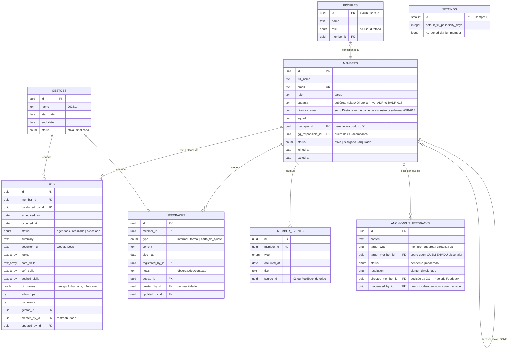
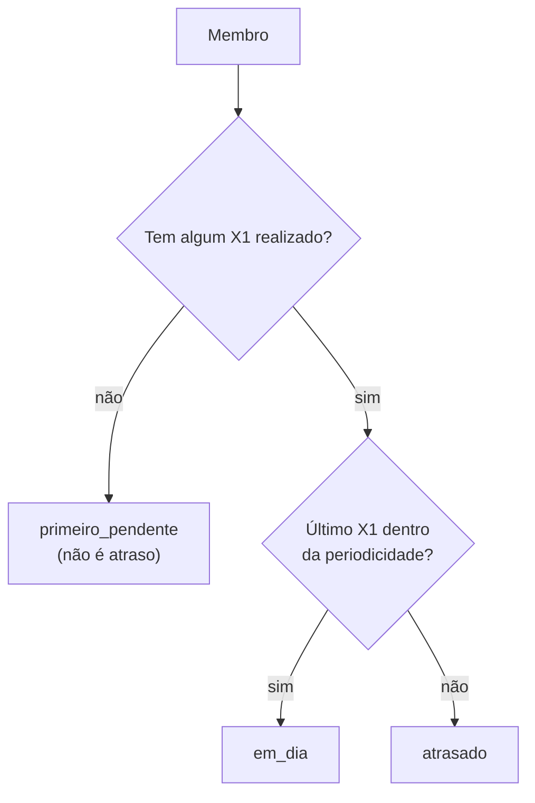
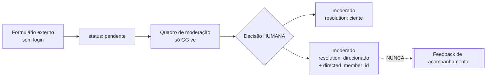

# DATA_MODEL — entidades, relacionamentos e regras

Fonte de verdade em código: `src/data/types.ts`.
Schema do banco: `supabase/migrations/0001_fase1_schema.sql`.

---

## 1. Visão geral



**Repare no que NÃO existe:** não há ligação entre `ANONYMOUS_FEEDBACKS` e
`FEEDBACKS`. É proposital — são fluxos independentes.

---

## 2. Membro

A entidade central. Tudo se relaciona a ela.

### Cardinalidades

| Relação | Cardinalidade |
| --- | --- |
| Membro → X1 | 1 para muitos |
| Membro → Feedback | 1 para muitos (ilimitado) |
| Membro → Evento | 1 para muitos |
| Membro → gerente | muitos para 1 (outro membro) |
| Membro → responsável de GG | muitos para 1 (outro membro) |

### Decisão: posição atual no membro, mudanças em eventos

`subarea`, `squad`, `role` e `manager_id` guardam o valor **atual** direto na
tabela `members`. As **mudanças** são registradas em `member_events`.

Por quê: quase toda tela precisa da posição atual, e obrigar toda listagem a
fazer junção temporal deixaria o código difícil para quem está começando. Ao
mesmo tempo, a regra "não sobrescreva o passado" continua valendo — o evento
preserva o histórico.

Na prática, `updateMember()` cria o evento automaticamente quando `subarea` ou
`role` mudam. Você não precisa lembrar de fazer isso.

### Hierarquia área → subárea

O que o membro tem de fato é uma **subárea** (`Desenvolvimento`, `Produto`,
`Inteligência de Dados`, `Marketing`, `Comercial`, `Institucional`, `Inovação`
ou `Gente e Gestão`) — é o nível em que a pessoa realmente atua. **Área** é a
divisão maior, um agrupamento de subáreas (`Gente e Gestão`, `Soluções`,
`Negócios`, `Institucional`), e nunca é guardada redundantemente no membro
para quem integra uma subárea: é sempre derivada via `getAreaForSubarea()`, a
partir da única fonte de verdade `AREA_STRUCTURE: Record<Area, Subarea[]>`
(`src/data/types.ts`). A exceção é a Diretoria, que não tem subárea — ver a
subseção abaixo.

`MemberFilters` aceita tanto `subarea` (filtro exato) quanto `area` (todas as
subáreas daquela área, mais a Diretoria dela). As duas telas de listagem
(Membros, Feedbacks) e os dois adapters (mock e Supabase) leem da mesma
`AREA_STRUCTURE` — não há como divergirem.

`AREA_STRUCTURE` representa a nomenclatura da **gestão atual**. Nomes de
subárea podem mudar de uma gestão para outra; a Fase 1 não versiona esse
catálogo — quando gestões passadas forem importadas, a nomenclatura da época
fica registrada como texto livre em `member_events` (o mesmo mecanismo
append-only da seção 6), não dentro do union type `Subarea`. Ver ADR-015 para
o raciocínio completo e as alternativas descartadas.

No cadastro (`MemberForm`), a Área aparece como um select que só GUIA a
escolha de Subárea — filtrando as opções e realocando a Subárea quando a
Área muda — mas continua sem ser gravada em lugar nenhum: a área exibida em
qualquer tela deriva sempre de `getAreaForSubarea(subarea)`. Ver ADR-016.

#### Diretoria: lidera a Área, não integra subárea nenhuma (ADR-018)

A Diretoria é um caso à parte na hierarquia acima: ela lidera uma **Área**
inteira (todas as subáreas dela), e por isso **não integra nenhuma
subárea especifica** — diferente de qualquer outro cargo do organograma.

- `Member.subarea: Subarea | null` — `null` é o que marca alguém como
  Diretoria.
- `Member.diretoriaArea?: Area | null` — preenchido **só** quando `subarea`
  é `null`. Os dois campos são mutuamente exclusivos, reforçado por uma
  `check constraint` no banco (migration `0007`): toda pessoa está numa
  subárea OU é Diretoria de uma área, nunca as duas coisas nem nenhuma.
- `getMemberArea(member): Area | null` — a função a usar sempre que uma
  tela precisa "a área desta pessoa". Deriva de `subarea` quando ela existe,
  ou lê `diretoriaArea` direto quando não existe. **Nunca** chame
  `getAreaForSubarea(member.subarea)` direto num `Member` — quebra (ou
  compila errado) para quem é da Diretoria.
- `memberSubareaLabel(member): string` — rótulo de exibição único para
  "onde esta pessoa está": a subárea normalmente, ou `"Diretoria (<Área>)"`
  para quem não tem subárea. Toda tela que exibe a posição de um membro usa
  esta função em vez de ler `member.subarea` direto.

Ver ADR-018 para o histórico completo dessa correção — o desenho anterior
(ADR-017) tinha modelado a Diretoria como um cargo extra dentro de uma
subárea escolhida livremente, o que estava errado.

### Cargo: vocabulário fechado por subárea/área

`role` não é mais texto livre — é um `Cargo`, um union type fechado com os
cargos vigentes NA GESTÃO ATUAL (ver ADR-017, revisada pela ADR-018 na parte
de Diretoria). Duas tabelas em `src/data/types.ts` são a fonte de verdade:

- `CARGOS_POR_SUBAREA: Record<Subarea, Cargo[]>` — os cargos de cada
  subárea. O **último** cargo de cada lista é a liderança maior daquela
  subárea (não existe um campo booleano separado para isso).
- `CARGOS_DIRETORIA: Record<Area, Cargo>` — os quatro cargos de Diretoria,
  ligados à **Área** (não à subárea): cada um lidera uma área inteira,
  respondendo por todas as subáreas dela.

`cargoOptionsForSubarea(subarea)` devolve **só** os cargos daquela subárea —
desde a ADR-018, a Diretoria deixou de aparecer aqui como opção extra (era
assim na ADR-017 original). Cadastrar alguém da Diretoria é um caminho
separado no formulário (`positionType: 'diretoria'`), que usa
`CARGOS_DIRETORIA[área]` diretamente, travando o cargo em vez de oferecê-lo
como escolha. `cargoOptionsForSubarea()`, a validação (`memberSchema.ts`,
com `z.enum` + checagem cruzada cargo × subárea/área) e a importação de CSV
(`parseCargo()`/`parseDiretoriaCargo()`) são a única fonte de opções válidas
— nenhuma lista duplicada.

Igual à hierarquia área → subárea, `CARGOS_POR_SUBAREA`/`CARGOS_DIRETORIA`
representam a nomenclatura da **gestão atual**, não um catálogo versionado.
Nomes de cargo podem mudar de uma gestão para outra; quando isso acontecer,
a nomenclatura antiga fica registrada como texto livre em `member_events`
(mesmo mecanismo já usado para `mudanca_cargo`), sem exigir uma migration de
schema — `members.role` continua `text` livre no banco, sem enum nem check
constraint. Ver ADR-017 para o raciocínio completo do vocabulário e ADR-018
para a correção do modelo de Diretoria.

### Ciclo de vida

| Status | Significado |
| --- | --- |
| `ativo` | Membro atual do CITi |
| `desligado` | Saiu sem concluir; histórico preservado |
| `arquivado` | Saiu por ter concluído sua passagem no CITi (ex.: formou); histórico preservado |

**Não existe exclusão.** `archiveMember()` é a operação disponível.

O documento de contexto oficial do projeto define a situação do membro com
três valores — `Ativo`, `Desligado` e `Concluído`. Em vez de adicionar um
quarto valor ao enum, `arquivado` (que já existia no código) passou a
representar especificamente "Concluído" — ver ADR-014 para o raciocínio.

---

## 3. X1

### Estados de um REGISTRO de X1

`agendado` → `realizado` (ou `cancelado`).

O banco garante: um X1 `realizado` obrigatoriamente tem `occurred_at`.

### Situação do MEMBRO — calculada, nunca gravada

Isto é diferente do estado do registro, e a confusão entre os dois é o erro mais
comum nesta parte do modelo.



```ts
import { getMemberX1Status, useSettings, useX1sByMember } from '@/data';

const status = getMemberX1Status(member, x1s, settings);
// 'primeiro_pendente' | 'em_dia' | 'atrasado'
```

**Nunca grave "atrasado" em uma coluna.** Isso ficaria desatualizado no dia
seguinte e faria a plataforma mentir sobre a situação de uma pessoa.

#### Na listagem, sem uma consulta por pessoa

O Perfil tem o histórico completo de uma pessoa e usa `getMemberX1Status()`. A
listagem precisa da situação de todo mundo ao mesmo tempo — pedir o histórico de
cada um seria uma consulta por linha (N+1).

Para isso existe uma leitura dedicada:

```ts
import { memberX1StatusFrom, useLastCompletedX1ByMember, useSettings } from '@/data';

const { data: lastX1 } = useLastCompletedX1ByMember(); // uma consulta só
const status = memberX1StatusFrom(lastX1?.[member.id], periodicidade);
```

`db.x1.listLastCompletedByMember()` devolve o último X1 **realizado** de cada
membro. No Postgres é um `distinct on (member_id)`; no mock é uma varredura.

`getMemberX1Status()` delega para `memberX1StatusFrom()`, então as duas telas
aplicam literalmente a mesma regra e não podem divergir.

#### Outras coisas derivadas do mesmo histórico

| Derivado | Função | Observação |
| --- | --- | --- |
| Último X1 | `lastCompletedX1(x1s)` | só `realizado` com `occurredAt` |
| Próximo agendado | `nextScheduledX1(x1s)` | `null` = não agendado |
| Próximo recomendado | `nextRecommendedX1Date(x1s, dias)` | `null` quando o próximo é o primeiro |
| Periodicidade da pessoa | `x1PeriodicityFor(id, settings)` | exceção ou padrão |

Nenhum deles tem coluna no banco. **Não crie.**

### Os seis estados do produto, no código

O documento de contexto lista seis estados relevantes. Eles vivem em dois eixos
diferentes — misturá-los é o erro mais comum nesta parte do modelo:

| Estado do produto | Onde vive |
| --- | --- |
| Agendado · Realizado | `X1.status` — situação do **registro** |
| Primeiro X1 pendente · Em dia · Atrasado | `getMemberX1Status()` — situação do **membro**, calculada |
| Não agendado | `nextScheduledX1(x1s) === null` |

### Campos do registro

O documento de contexto define o que um X1 registra. Todos existem no modelo:

| Campo | Tipo | Observação |
| --- | --- | --- |
| `occurredAt` / `scheduledFor` | data | |
| `conductedById` | membro | quem conduziu |
| `documentUrl` | texto | **Google Docs** com a transcrição |
| `summary` | texto | resumo |
| `topics` | lista | principais pontos |
| `hardSkills` | lista | hard skills citadas |
| `softSkills` | lista | soft skills citadas |
| `desiredSkills` | lista | o que a pessoa quer desenvolver — alimenta o futuro PDI |
| `followUps` | texto | encaminhamentos |
| `citiValues` | lista de `{value, rating, note}` | avaliação dos valores do CITi |
| `comments` | texto | comentários relevantes |
| `gestaoId` | gestão | preserva o contexto da época |

⚠️ **`citiValues` é percepção humana registrada, não score.** Não derive
classificação de engajamento dela na Fase 1 — engScore é Fase 2 e configurável
por gestão.

Os quatro valores estão em `CITI_VALUES`: *Eu sou o CITi · Obcecados por
aprender · Obcecados por vencer · Obcecados por entregar*.

### Periodicidade

- Padrão: `settings.defaultX1PeriodicityDays` (o CITi usa **30**).
- Exceção por membro: `settings.x1PeriodicityByMember[memberId]`.
- Use `x1PeriodicityFor(memberId, settings)` — ele já resolve a precedência.

---

## 4. Feedback de acompanhamento

Três tipos, definidos pelo produto:

| Tipo | Valor no código |
| --- | --- |
| Informal | `informal` |
| Formal | `formal` |
| Carta de Ajuste | `carta_de_ajuste` |

**Ilimitados por membro.** Não existem "slots". Se alguém pedir campos como
"FI1" e "FI2", isso contraria a regra de produto — ver
[PROJECT_CONTEXT.md](PROJECT_CONTEXT.md) §4.3.

Criar um feedback gera automaticamente um evento na timeline do membro.

---

## 5. Feedback Anônimo

⚠️ **Fluxo independente.** Leia com atenção antes de mexer.



### Dois eixos, não três estados

O erro mais fácil de cometer aqui é achatar tudo em uma lista de estados. São
duas perguntas diferentes:

| Pergunta | Onde vive |
| --- | --- |
| Isto ainda precisa da GG? | `status` — `pendente` ou `moderado` |
| O que a GG decidiu? | `resolution` — `ciente` ou `direcionado` |

O quadro de moderação **deriva** suas três colunas dessa combinação
(`features/anonymous-feedback/model/moderationBoard.ts`). Não existe coluna
"coluna" no banco, e não deve passar a existir — é o que garante que o quadro
nunca discorde do registro.

```text
status 'pendente'         → Pendentes
resolution 'direcionado'  → Direcionados
resolution 'ciente'       → Cientes
```

### `target_member_id` ≠ `directed_member_id`

Confundir os dois é o segundo erro fácil.

| Campo | Significa | Quem preencheu |
| --- | --- | --- |
| `target_member_id` | sobre quem o relato diz falar | quem **enviou**, no formulário |
| `directed_member_id` | a quem o contexto foi levado | a **GG**, ao moderar |

Um relato sobre a subárea pode acabar direcionado à gerência dela; um relato
sobre uma pessoa pode acabar apenas como "ciente", sem direcionamento nenhum.
O banco garante que `directed_member_id` só existe quando
`resolution = 'direcionado'`.

Regras estruturais:

1. **Nenhuma coluna identifica quem enviou.** Não há `author`, `email`, `ip`.
   O anonimato vem da ausência do campo, não de uma regra de exibição.
   `moderated_by_id` é quem **moderou**, nunca quem enviou.
2. **Não existe conversão.** Nenhuma função em `src/data/anonymousFeedback.ts`
   cria um `Feedback`, e nenhuma deve passar a existir. Dois testes garantem
   isso: `mockAdapter.test.ts` (camada de dados) e `feedbacksFlow.test.tsx`
   (fluxo completo — direcionar não muda contagem de acompanhamento nenhuma).
3. **A decisão é humana.** Nada toma ciência nem direciona sozinho, e
   direcionar exige escolher a pessoa em um passo explícito.
4. O alvo pode ser um membro, uma subárea, a diretoria ou o CITi.
   O banco garante que `target_member_id` só é preenchido quando o alvo é membro.
5. **Não é "aprovar/rejeitar".** Não existe publicação a aprovar — ver ADR-013.

Acesso no Supabase (RLS): **qualquer pessoa insere**, **só GG lê e modera**.

---

## 6. Eventos do membro (timeline)

Tabela **append-only**: registros são criados, nunca alterados.

| Tipo | Quando é criado |
| --- | --- |
| `entrada` | Ao cadastrar o membro |
| `mudanca_subarea` | Ao mudar a subárea |
| `mudanca_cargo` | Ao mudar o cargo |
| `mudanca_gerente` | Ao mudar o gerente |
| `x1` | Ao registrar um X1 como realizado |
| `feedback` | Ao registrar um feedback |
| `desligamento` | Ao desligar o membro |
| `observacao` | Registro manual |

A camada de dados cria esses eventos sozinha. Alimenta `PERFIL-004` (Timeline).

---

## 6b. Gestões

A plataforma atravessa gestões, e isso é **requisito estrutural** do produto:

> Uma regra configurável não deve apagar a interpretação do passado.

Na Fase 1 a entidade `Gestao` é mínima — id, nome (`2026.1`), período e status.
Serve para **carimbar** X1 e Feedback com a gestão em que aconteceram.

```ts
const { data: gestao } = useCurrentGestao();
createX1({ ...campos, gestaoId: gestao?.id ?? null });
```

O banco garante que só existe **uma gestão ativa** por vez.

⚠️ O módulo completo de gestões — metas, indicadores, passagem de gestão — é
evolução futura. Não construa agora. Ver ADR-012.

---

## 6c. Rastreabilidade

Registros relevantes guardam **quem criou, quando, quem alterou e quando**:

| Campo | Significado |
| --- | --- |
| `createdById` / `updatedById` | quem **digitou** o registro na plataforma |
| `createdAt` / `updatedAt` | quando — preenchidos automaticamente |

Não confunda com os campos semânticos: `conductedById` é quem **conduziu** o X1,
`registeredById` é quem **deu** o feedback. Uma pessoa pode registrar na
plataforma um X1 conduzido por outra.

Em `anonymous_feedbacks`, `moderatedById` é quem **moderou** — nunca quem
enviou. Ver §5.

---

## 7. Configurações

Tabela de **linha única** (`id = 1`). Guarda só o que a Fase 1 precisa:
periodicidade padrão de X1, exceções por membro e a gestão corrente
(`currentGestaoId`).

---

## 8. Perfis e acesso

`profiles` é a lista de quem pode entrar na plataforma.

Ter conta no Supabase Auth **não é suficiente**: sem linha em `profiles`, o
login é recusado com uma mensagem clara. É assim que a GG controla o acesso sem
existir autorregistro.

---

## 9. Convenções

| Assunto | Convenção |
| --- | --- |
| Identificadores | `uuid` no banco, `string` no TypeScript |
| Datas de calendário | `date` no banco, ISO `'2026-03-15'` no código |
| Datas com hora | `timestamptz`, ISO completo |
| Nomes de coluna | `snake_case` no banco, `camelCase` no código |
| Tradução entre os dois | `src/data/supabase/mappers.ts` |
| Textos vazios | `null`, nunca `''` |

---

## 10. Como mudar o modelo

Uma mudança de schema anda com **quatro** arquivos. Fazer só um deles faz o modo
mock e o real divergirem — e o bug só aparece na integração.

1. `supabase/migrations/000X_*.sql` — migration nova (nunca edite uma aplicada)
2. `src/data/types.ts` — o tipo
3. `src/data/mock/mockAdapter.ts` (+ `fixtures.ts`)
4. `src/data/supabase/mappers.ts` e `supabaseAdapter.ts`

**Responsável: Sofia.** Não faça isso sozinho em uma branch de feature — abra a
conversa antes.
